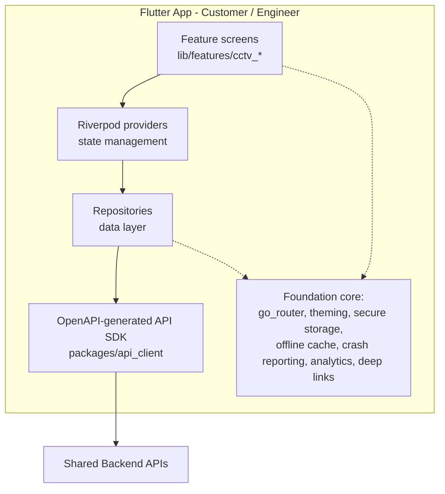

# Mobile Architecture

**Project:** Aarvii CCTV AMC Management System
**Phase:** D0 — Project Foundation Documentation
**Source of truth:** [requirements-freeze-v1.md §18](./requirements-freeze-v1.md) (Mobile Applications) · §20 (Platform reuse)

Two **Flutter** applications are approved for V1, built on the existing platform **Mobile Foundation** (no duplicate implementation, §20).

---

## 1. Customer App

**Approved features (freeze §18):** Dashboard · AMC · Tickets · Invoices · Notifications · Profile

| Feature | Behavior (freeze refs) |
|---------|------------------------|
| Dashboard | Summary of the customer's AMC status, upcoming visits, open tickets |
| AMC | Current active contract term (§8); renewal request (§3) |
| Tickets | Create, track, reopen closed tickets (§14) |
| Invoices | View and download invoice PDFs (§16, §19) |
| Notifications | Receive notification events relevant to the customer (§17) |
| Profile | Profile management and password reset (OTP, §17) |

## 2. Engineer App

**Approved features (freeze §18):** Visits · Tickets · Photo Upload · GPS Capture · Signature Capture · **Offline Support**

| Feature | Behavior (freeze refs) |
|---------|------------------------|
| Visits | Assigned visit queue; visit execution and report submission (§11–§13) |
| Tickets | Assigned tickets; create tickets during visits (§14) |
| Photo Upload | Before/During/After photos; videos (§12, §15) |
| GPS Capture | Latitude, longitude, timestamp recorded with the visit (§12) |
| Selfie Capture | Mandatory engineer selfie for completion (§12) |
| Signature Capture | Customer signs on the engineer's device (§12) |
| Offline Support | Field operation without connectivity; sync on reconnect (§18) |

## 3. Flutter architecture (inherited from Mobile Foundation)

| Concern | Approach (platform ADRs) |
|---------|--------------------------|
| State management | Riverpod ([ADR-Mobile-0001](../adr/ADR-Mobile-0001-state-management.md)) |
| Navigation | go_router ([ADR-Mobile-0002](../adr/ADR-Mobile-0002-navigation.md)) |
| Environments | dev/qa/uat/prod build flavors ([ADR-Mobile-0003](../adr/ADR-Mobile-0003-environment-configuration.md)) |
| API client | OpenAPI-generated SDK ([ADR-Mobile-0005](../adr/ADR-Mobile-0005-openapi-sdk-generation.md)) |
| Feature structure | `lib/features/<feature>/` — pages, providers, data, models, widgets (business-module convention) |
| Crash/analytics | Platform abstractions ([ADR-Mobile-0008](../adr/ADR-Mobile-0008-crash-reporting.md), [ADR-Mobile-0009](../adr/ADR-Mobile-0009-analytics.md)) |
| Release | fastlane + existing CI pipelines ([ADR-Mobile-0010..0012](../adr/ADR-Mobile-0010-release-strategy.md)) |

CCTV mobile features are added as **new feature slices** consuming the generated SDK — the foundation itself is not modified (freeze §20).

## 4. Offline support (Engineer App, §18)

Built on the foundation's offline cache ([ADR-Mobile-0007](../adr/ADR-Mobile-0007-offline-cache.md)):

| Concern | Design |
|---------|--------|
| Read-side | Assigned visits/tickets cached locally for offline viewing |
| Write-side | Visit evidence (photos, selfie, GPS, signature, remarks) captured and queued locally when offline |
| Sync | Queued submissions upload when connectivity returns; report submission completes server-side validation (§12 checklist) on sync |
| Evidence timestamps | GPS timestamp recorded at capture time, not at sync time (§12) |
| Conflicts | Visit/ticket status transitions validated by the backend on sync; rejected submissions surface to the engineer for correction |

> Note: the Customer App has no approved offline requirement; offline support is an Engineer App feature per freeze §18.

## 5. Notifications

| Channel | Usage |
|---------|-------|
| Email + SMS | The approved business notification channels (§17) — delivered server-side |
| Push (foundation capability) | The Customer App lists **Notifications** as a feature (§18); in-app notification display uses the Mobile Foundation's notification/push plumbing ([ADR-Mobile-0006](../adr/ADR-Mobile-0006-push-notifications.md)) to surface the approved events |

Approved events surfaced to mobile users (§17): Ticket Created/Assigned/Closed, Visit Scheduled/Completed, AMC Expiry Reminder, Invoice Generated, OTPs.

## 6. Authentication

| Concern | Design |
|---------|--------|
| Login | Platform Auth (JWT/OAuth2) via the foundation auth feature; Login OTP supported (§17) |
| Token storage | Secure storage ([ADR-Mobile-0004](../adr/ADR-Mobile-0004-secure-token-storage.md)) |
| Password reset | OTP-based (§17) |
| Roles | Customer App ↔ Customer role; Engineer App ↔ Engineer role; server-side enforcement of §3/§15 permissions |
| Sessions | Platform session management (list/revoke) available via foundation |

---

## App feature ↔ module traceability

| App feature | Backend module |
|-------------|----------------|
| Customer: Dashboard / AMC | AMC Contracts (7), Customer Portal (14) |
| Customer: Tickets | Ticket Management (10) |
| Customer: Invoices | Invoice Management (12) |
| Customer: Notifications / Profile | Notifications (§17), Customer Management (3), platform Auth |
| Engineer: Visits | Service Scheduling (8), Visit Management (9) |
| Engineer: Tickets | Ticket Management (10) |
| Engineer: Media / GPS / Signature | Visit Management (9), platform Files |

---

## Related documents

- [application-architecture.md](./application-architecture.md)
- [navigation-map.md](./navigation-map.md)
- [screen-inventory.md](./screen-inventory.md)
- Platform mobile docs: [../mobile/mobile-platform-manifest.md](../mobile/mobile-platform-manifest.md)
