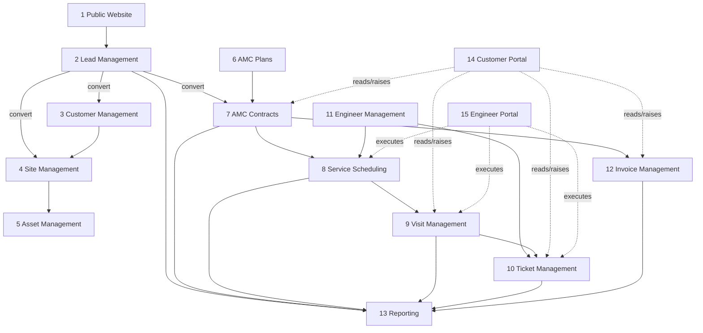

# Module Architecture

**Project:** Aarvii CCTV AMC Management System
**Phase:** D0 — Project Foundation Documentation
**Source of truth:** [requirements-freeze-v1.md §4](./requirements-freeze-v1.md) (Approved Modules)

Each of the **15 approved modules** is described with responsibilities, boundaries, dependencies, and future extensibility. All are **business modules** on the frozen Ashraak platform — optional, decoupled, replaceable, independently deployable ([business-module-policy](../governance/business-module-policy.md)). Dependencies on Core are via published contracts only (freeze §20).

---

## 1. Public Website

| Aspect | Detail |
|--------|--------|
| Responsibilities | Showcase pages (Home, About, Services, AMC Services, Contact, Gallery, Testimonials, Login); Get Quote + AMC Inquiry forms; reuse existing content (§2) |
| Boundaries | Anonymous only; no business data displayed; submits inquiries to Lead Management |
| Dependencies | Lead Management (inquiry → lead); platform Auth (login entry) |
| Future extensibility | New content pages, SEO enhancements, additional inquiry form types |

## 2. Lead Management

| Aspect | Detail |
|--------|--------|
| Responsibilities | Lead capture (auto from website), pipeline statuses (§10), conversion creating Customer + Site + Initial AMC Contract; Lead Created/Converted notifications (§17) |
| Boundaries | Owns leads only; conversion *initiates* records in Customer/Site/AMC modules but doesn't own them; not a general CRM (§21) |
| Dependencies | Customer/Site/AMC Contracts (conversion), Notifications |
| Future extensibility | Additional lead sources, scoring, campaign attribution (change request required) |

## 3. Customer Management

| Aspect | Detail |
|--------|--------|
| Responsibilities | Customer master records; customer profile self-service; customer ↔ user account linkage (§3, §5) |
| Boundaries | Owns customers, not sites/contracts; credentials owned by platform Auth |
| Dependencies | Platform Auth/Users (accounts, profile), Site Management |
| Future extensibility | Customer segmentation, additional profile attributes |

## 4. Site Management

| Aspect | Detail |
|--------|--------|
| Responsibilities | Sites per customer; ≤3 contact persons per site; site as aggregation point for assets, contract, visits, tickets, invoices (§5, §6) |
| Boundaries | One site = one customer; enforces single active AMC contract per site (with AMC Contracts) |
| Dependencies | Customer Management |
| Future extensibility | Site geo-metadata, site grouping/regions |

## 5. Asset Management

| Aspect | Detail |
|--------|--------|
| Responsibilities | Per-site **summary counts**: Camera, DVR, NVR, Hard Disk, Switch, Router, Monitor (+ optional Brand/Model/Remarks) (§7) |
| Boundaries | **No individual device tracking** (§7); no inventory/stock (§21) |
| Dependencies | Site Management |
| Future extensibility | Per-device tracking would be a V2+ change request — current model deliberately summary-only |

## 6. AMC Plans

| Aspect | Detail |
|--------|--------|
| Responsibilities | Plan catalog (Silver/Gold/Platinum examples) with Price, Visit Frequency, Included Services, SLA; **plan versioning** (§9) |
| Boundaries | Plan changes never mutate historical contracts (§9); plans are admin-managed only (§15) |
| Dependencies | None on other CCTV modules (referenced by AMC Contracts) |
| Future extensibility | New plan tiers and versions are native; pricing models per change request |

## 7. AMC Contracts

| Aspect | Detail |
|--------|--------|
| Responsibilities | Contract **Master + Terms** model; renewal history; active-term resolution; customer renewal requests; expiry reminders; AMC Contract PDF (§3, §8, §17, §19) |
| Boundaries | One active contract per site (§6); customer sees active term only, admin sees history (§8); pins plan version at term creation (§9) |
| Dependencies | Site Management, AMC Plans, Invoice Management (term-linked invoices), Notifications, platform Files (PDF) |
| Future extensibility | New term types/renewal flows via change request; webhook events for contract lifecycle |

## 8. Service Scheduling

| Aspect | Detail |
|--------|--------|
| Responsibilities | Auto-generate visits from AMC plan frequency; schedule lifecycle (Planned→…→Cancelled); admin rescheduling; **mandatory engineer assignment**; Visit Scheduled notifications (§11, §17) |
| Boundaries | Owns the schedule; execution evidence belongs to Visit Management |
| Dependencies | AMC Contracts (frequency source), Engineer Management (assignment), Notifications |
| Future extensibility | Capacity/route planning per change request |

## 9. Visit Management

| Aspect | Detail |
|--------|--------|
| Responsibilities | Visit execution: selfie, GPS (lat/long/timestamp), before/during/after photos, videos, signature, remarks; completion checklist; **admin approval workflow**; Visit Report PDF; Visit Completed notification (§12, §13, §17, §19) |
| Boundaries | Customer visibility strictly post-approval (§13); evidence requirements non-bypassable (§12) |
| Dependencies | Service Scheduling, platform Files (media), Notifications, Ticket Management (tickets raised during visits) |
| Future extensibility | Additional evidence types or checklists via change request |

## 10. Ticket Management

| Aspect | Detail |
|--------|--------|
| Responsibilities | Complaint tickets: lifecycle (Open→…→Reopened), priorities (Low→Critical), creation by Customer/Admin/Engineer, customer reopen; ticket notifications (§14, §17) |
| Boundaries | Not a generic helpdesk; scoped to customer/site service complaints |
| Dependencies | Customer/Site (context), Engineer Management (assignment), Notifications |
| Future extensibility | SLA timers tied to plan SLA, escalation rules via change request |

## 11. Engineer Management

| Aspect | Detail |
|--------|--------|
| Responsibilities | Engineer records and admin management; engineer work-queue surfaces (assigned visits/tickets) (§3, §15) |
| Boundaries | Engineers cannot manage customers, plans, or contracts (§15); no payroll/attendance/geo-tracking (§21) |
| Dependencies | Platform Auth/Users (engineer accounts, roles) |
| Future extensibility | Skills, territories, availability via change request |

## 12. Invoice Management

| Aspect | Detail |
|--------|--------|
| Responsibilities | Invoice lifecycle (Draft→Generated→Sent→Paid/Cancelled); **link to AMC Contract Term**; customer PDF download; Invoice Generated notification (§16, §17, §19) |
| Boundaries | **No accounting features** (§16); no payment gateway (§21) |
| Dependencies | AMC Contracts (terms), Notifications, platform Files (PDF) |
| Future extensibility | Payment gateway and accounting integrations are explicit V2+ change requests |

## 13. Reporting

| Aspect | Detail |
|--------|--------|
| Responsibilities | Admin reporting across leads, contracts, visits, tickets, invoices, engineers (§2) |
| Boundaries | Read-only aggregation; no data ownership |
| Dependencies | Reads from all business modules |
| Future extensibility | New reports additive; dashboards/charts per platform chart contract |

## 14. Customer Portal

| Aspect | Detail |
|--------|--------|
| Responsibilities | Customer-facing experience (web + mobile): dashboard, AMC details, service history, upcoming visits, tickets, invoices, profile, password reset (§2) |
| Boundaries | Own-data only (§3); approved reports only (§13); active term only (§8) |
| Dependencies | AMC Contracts, Visit, Ticket, Invoice modules; platform Auth; Theme Engine (`platform-ui`) |
| Future extensibility | New self-service features via change request |

## 15. Engineer Portal

| Aspect | Detail |
|--------|--------|
| Responsibilities | Engineer-facing experience (web + mobile): assigned work, visit reporting, media capture, signature, ticket creation (§2) |
| Boundaries | Assigned work only; §15 restrictions apply |
| Dependencies | Scheduling, Visit, Ticket modules; platform Auth; Theme Engine; mobile offline support (§18) |
| Future extensibility | Additional field workflows via change request |

---

## Cross-cutting platform reuse (freeze §20)

| Platform capability | Consumed by |
|---------------------|-------------|
| Authentication / Roles / Permissions | All portals and APIs |
| Files | Visit media, signatures, PDFs |
| Notifications (email) + SMS provider | Modules 2, 7, 8, 9, 10, 12; Auth OTPs |
| Audit | All business actions (observer) |
| Theme Engine | All web portal UIs |
| Mobile Foundation | Customer & Engineer apps |
| API Keys / Webhooks | External integration surfaces |

**No duplicate implementation** of any of the above.

---

## Related documents

- [high-level-design.md](./high-level-design.md)
- [application-architecture.md](./application-architecture.md)
- [business-rules.md](./business-rules.md)
- Platform module conventions: [../extending/add-backend-module.md](../extending/add-backend-module.md)
