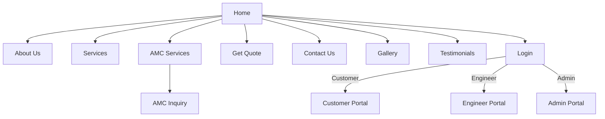
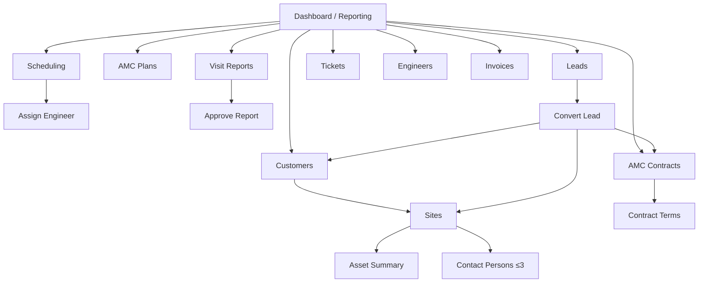

# Navigation Map

**Project:** Aarvii CCTV AMC Management System
**Phase:** D0 — Project Foundation Documentation
**Source of truth:** [requirements-freeze-v1.md §2](./requirements-freeze-v1.md) (Applications)

Navigation trees for the four applications. Every node traces to an approved page/feature; no screens beyond the frozen scope.

---

## 1. Public Website (www.aarvii.in)

```
Public Website
├── Home
├── About Us
├── Services
├── AMC Services
│   └── AMC Inquiry            (enhancement)
├── Get Quote                  (enhancement)
├── Contact Us
├── Gallery
├── Testimonials
└── Login                      → role-based redirect to portal
```



## 2. Customer Portal (web; mobile mirrors per §18)

```
Customer Portal
├── Dashboard
├── AMC
│   ├── AMC Details (current active term)
│   └── Request Renewal
├── Service
│   ├── Upcoming Visits
│   └── Service History (approved reports only)
├── Tickets
│   ├── My Tickets (list / detail)
│   ├── Create Ticket
│   └── Reopen Ticket (from closed ticket detail)
├── Invoices
│   ├── Invoice List
│   └── Invoice Detail / Download PDF
└── Profile
    ├── Profile Management
    └── Password Reset (OTP)
```

## 3. Engineer Portal (web; mobile mirrors per §18)

```
Engineer Portal
├── Assigned Visits
│   ├── Visit List (by status)
│   └── Visit Detail
│       └── Visit Reporting
│           ├── Photo Upload (Before / During / After, videos)
│           ├── Selfie Capture
│           ├── GPS Capture
│           ├── Customer Signature
│           ├── Visit Remarks
│           └── Submit Report (→ admin review)
├── Assigned Tickets
│   ├── Ticket List
│   └── Ticket Detail (progress updates)
└── Create Ticket (during visit)
```

## 4. Admin Portal

```
Admin Portal
├── Dashboard / Reporting
├── Leads
│   ├── Lead List (pipeline statuses)
│   ├── Lead Detail (status transitions)
│   └── Convert Lead (→ Customer + Site + Initial AMC Contract)
├── Customers
│   ├── Customer List
│   └── Customer Detail
│       └── Sites
│           ├── Site Detail
│           ├── Contact Persons (max 3)
│           └── Asset Summary (counts + brand/model/remarks)
├── AMC
│   ├── AMC Plans (versioned: price, frequency, services, SLA)
│   └── AMC Contracts
│       ├── Contract Master
│       ├── Contract Terms (renewal history)
│       └── Contract PDF
├── Scheduling
│   ├── Visit Calendar / List
│   ├── Assign Engineer (mandatory)
│   └── Reschedule Visit
├── Visits
│   ├── Visit Reports (pending review)
│   └── Approve Visit Report (→ customer visible)
├── Tickets
│   ├── Ticket List (status / priority)
│   ├── Ticket Detail
│   └── Create / Assign Ticket
├── Engineers
│   ├── Engineer List
│   └── Engineer Detail
└── Invoices
    ├── Invoice List
    ├── Invoice Detail (Draft → Generated → Sent → Paid / Cancelled)
    └── Invoice PDF
```



## 5. Mobile apps (freeze §18)

```
Customer App                      Engineer App
├── Dashboard                     ├── Visits
├── AMC                           │   └── Visit Reporting
├── Tickets                       │       (photos, selfie, GPS, signature)
├── Invoices                      ├── Tickets (incl. create)
├── Notifications                 └── (Offline-capable)
└── Profile
```

---

## Related documents

- [screen-inventory.md](./screen-inventory.md)
- [application-architecture.md](./application-architecture.md)
- [mobile-architecture.md](./mobile-architecture.md)
