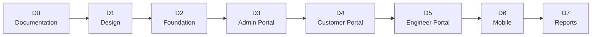

# Project Roadmap

**Project:** Aarvii CCTV AMC Management System
**Phase:** D0 — Project Foundation Documentation
**Source of truth:** [requirements-freeze-v1.md](./requirements-freeze-v1.md) (scope) — phases D0–D7 as approved.

> The roadmap sequences delivery of the **frozen V1 scope only**. No phase introduces functionality beyond the freeze document.

---

## Phase overview

---

## D0 — Documentation (current phase)

Foundation documentation before any design or build.

| Step | Deliverables | Status |
|------|-------------|--------|
| D0-1..3 | Product vision, scope freeze, personas, BRD, business rules, workflows, HLD, application/module/mobile architecture, navigation map, screen inventory, roadmap (+ PDFs) | ✅ This delivery |
| D0-4 | Entity model & ER diagram design | ⏭ Next |

**Exit criteria:** all 13 foundation documents complete, cross-referenced to the freeze document, PDFs generated.

## D1 — Design

| Workstream | Deliverables |
|------------|-------------|
| Data design | Entity model, ERD, schema design per module (from D0-4) |
| API design | Endpoint contracts for all business modules |
| UI/UX design | Screen designs for the 69-screen inventory (web + mobile), using the platform Theme Engine |
| Architecture records | ADRs for significant CCTV business-module decisions (per platform governance) |

**Exit criteria:** approved ERD, API contracts, and screen designs traceable to the freeze document.

## D2 — Foundation

| Workstream | Deliverables |
|------------|-------------|
| Backend scaffolding | CCTV business module projects (Domain/Application/Infrastructure/Api) registered at Host Layer 2; per-module schemas |
| Core data modules | Customer, Site, Asset, Engineer masters; AMC Plans (versioned) and Contracts (master + terms) |
| Platform wiring | Roles/permissions for the 4 actors; SMS provider integration ✅ (D1-13c); PDF generation service ✅ (D1-13d); notification event wiring (§17) ✅ |
| Web shell | Portal routing/guards for Customer/Engineer/Admin areas |

**Exit criteria:** build green; masters manageable; auth roles enforced; module docs per governance.

## D3 — Admin Portal

Full admin capability (freeze §2 Admin Portal feature list):

- Lead Management (pipeline + conversion, §10)
- Customer / Site / Asset Management (§5–§7)
- AMC Plans + AMC Contracts with terms & PDFs (§8, §9, §19)
- Scheduling (auto-generation, reschedule, mandatory assignment, §11)
- Visit report review & approval (§13)
- Ticket Management (§14) · Engineer Management (§15) · Invoice Management + PDF (§16, §19)

**Exit criteria:** an admin can run the full business cycle end-to-end from the portal.

## D4 — Customer Portal (web)

Customer self-service (freeze §2 Customer Portal feature list):

- Dashboard · AMC Details (active term) · Service History (approved only) · Upcoming Visits
- Tickets (create / track / reopen) · Invoices (view / PDF download)
- Profile Management · Password Reset (OTP) · AMC renewal request

**Exit criteria:** customers self-serve all approved features against live admin-managed data.

## D5 — Engineer Portal (web)

Engineer field operations (freeze §2 Engineer Portal feature list):

- Assigned Visits & Tickets queues
- Visit Reporting with mandatory evidence: photos (before/during/after), selfie, GPS, signature, remarks (§12)
- Report submission → admin approval workflow (§13) · Ticket creation (§3)

**Exit criteria:** a visit can be executed and approved entirely through the system with all evidence enforced.

## D6 — Mobile

Flutter apps on the platform Mobile Foundation (freeze §18):

| App | Scope |
|-----|-------|
| Customer App | Dashboard, AMC, Tickets, Invoices, Notifications, Profile |
| Engineer App | Visits, Tickets, Photo Upload, GPS Capture, Signature Capture, **Offline Support** |

Plus: store-release readiness via existing CI pipelines.

**Exit criteria:** both apps feature-complete per §18; engineer offline capture & sync verified; release pipelines green.

## D7 — Reports

Admin Reporting module (freeze §2):

- Reporting dashboard and report views across leads, AMC contracts/renewals, visits, tickets, invoices, engineers
- **D1-13g (Wave 4):** LLD parity — filters, pagination, drill-down, CSV export, role guard ✅

**Exit criteria:** reporting live; all 12 success criteria of the [product vision](./product-vision-document.md) met; V1 acceptance.

---

## D1-13 — V1 scope completion (Wave 1–4)

| Wave | Focus | Status |
|------|-------|--------|
| Wave 1 | Public website + customer portal web | ✅ |
| Wave 2 | Notifications + production PDF | ✅ |
| Wave 3 | Mobile field parity + admin/auth UX | ✅ |
| Wave 4 | Reporting, video, push, invoice admin, mobile auth, public content | ✅ |

**Final report:** [d1-13-v1-scope-completion-report.md](./d1-13-v1-scope-completion-report.md)

**Code freeze recommendation:** Project is a **CODE FREEZE CANDIDATE** pending architectural review (~96% strict / ~97% weighted). Development on V1 scope must **STOP** until review approves freeze. UAT, performance testing, and deployment planning are **out of scope** until then.

---

## Cross-phase governance

| Rule | Applies |
|------|---------|
| Scope changes only via approved change request (freeze §22) | All phases |
| Core Platform remains frozen — business modules only ([freeze policy](../governance/platform-freeze-policy.md)) | D2–D7 |
| Docs evolve with code; 7-file module docs + ADRs ([documentation governance](../documentation-governance.md)) | D2–D7 |
| Out-of-scope list (§21) enforced in review | All phases |

---

## Related documents

- [requirements-freeze-v1.md](./requirements-freeze-v1.md)
- [business-requirements-document.md](./business-requirements-document.md)
- [high-level-design.md](./high-level-design.md)
- [screen-inventory.md](./screen-inventory.md)
