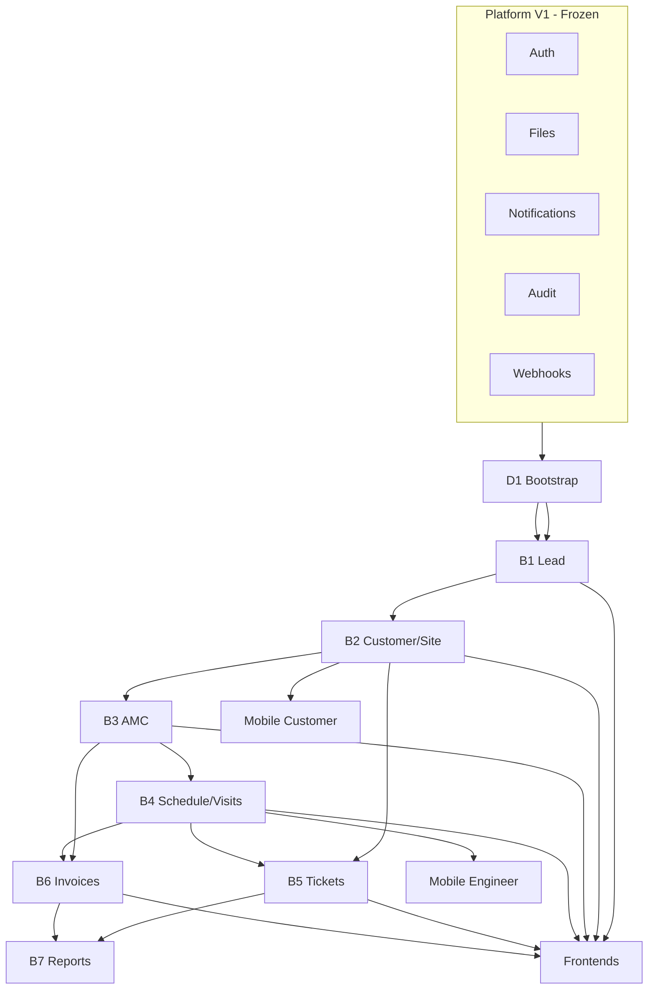

# Dependency Validation

**Project:** Aarvii CCTV AMC Management System  
**Phase:** D1-0 — Architecture Validation & Readiness Review

---

## 1. Executive summary

All dependency chains from D0 design through D0-8 roadmap are **valid and acyclic** at the module level. Cross-module coupling uses **SharedKernel contracts and domain events only** — no direct DbContext or repository references between CCTV modules.

**Verdict:** ✅ Dependencies validated — sequencing in sprint-plan and backend-development-phases is executable.

---

## 2. Module dependencies

| Module | Depends on | Blocks | Contract/Event interface |
|--------|------------|--------|--------------------------|
| D1 Bootstrap | Platform Host, Auth, Outbox | B1–B7 | Health endpoint only |
| Lead (B1) | D1 | B2, website forms | `ILeadConversionService` → B2/B3 |
| Customer (B2) | B1 (conversion) | B3, B5, portals | CustomerCreated event |
| AMC (B3) | B2 (site) | B4, B6, conversion complete | TermActivated → schedule gen |
| Service (B4) | B3 (contract/term) | B5, B6, engineer portal | VisitCompleted event |
| Ticket (B5) | B2, B4 (optional visit link) | B6, portals | TicketCreated event |
| Engineer (B5) | D1 | B4 assignment, B5 | EngineerAssigned event |
| Invoice (B6) | B3 (Option B term), B4/B5 optional | B7, portals | InvoiceGenerated event |
| Reporting (B7) | All business modules | Release | Read-only queries |

**Validation:** module-contracts.md dependency table matches above. **No circular module dependencies.**

---

## 3. API dependencies

| Consumer | Depends on API | Phase available |
|----------|----------------|:---------------:|
| Public inquiry forms | `POST /inquiries` | B1 |
| Lead conversion wizard | B2 customer/site + B3 contract APIs | B2 partial, B3 complete |
| Schedule auto-generation | B3 TermActivated handler | B3 |
| Visit evidence upload | Platform `POST /files` + B4 link | D1 + B4 |
| Visit approval | B4 visit status API | B4 |
| Customer portal tickets | B5 ticket APIs + B2 scope | B5 |
| Customer portal invoices | B6 invoice APIs | B6 |
| Engineer sync | B4 `POST /engineer/visits/sync` | B4 |
| Admin reports | B7 read APIs | B7 |
| Mobile apps | All portal-equivalent APIs | B2–B6 |

**Platform API dependencies (all available V1):**

| Platform API | CCTV consumers |
|--------------|----------------|
| `/connect/token` | All apps |
| `/api/v1/files` | Visits, tickets, leads, contracts |
| `/api/v1/users` | Admin user management |
| `/api/v1/audit-logs` | Admin #41 (stub) |
| `/api/v1/webhooks` | Admin #43 |

**No API dependency on unbuilt platform features.**

---

## 4. Database dependencies

| Schema | Created in | FK references (logical) |
|--------|------------|---------------------------|
| `cctv_lead` | B1 | → platform users (owner) |
| `cctv_customer` | B2 | → lead (optional), platform users |
| `cctv_amc` | B3 | → customer, site (IDs only) |
| `cctv_service` | B4 | → site, contract, engineer |
| `cctv_ticket` | B5 | → customer, site, visit (optional) |
| `cctv_engineer` | B5 | → platform users |
| `cctv_invoice` | B6 | → customer, term (Option B) |

**Rules validated:**
- Schema-per-module — no cross-schema FKs (IDs only)
- Additive migrations only V1
- Rollout order matches backend-development-phases (database-implementation-plan.md)

---

## 5. Frontend dependencies

| Portal phase | Requires backend | Platform reuse |
|--------------|------------------|----------------|
| FP-0 Shell | D1 routes + RBAC seeds | Router, guards, layout |
| FP-1 Lead UI | B1 APIs | platform-ui grids/forms |
| FP-2 Customer/Site | B2 APIs | FileUpload REUSE |
| FP-3 AMC | B3 APIs | — |
| FP-4 Schedule/Visit | B4 APIs | — |
| FP-5 Tickets/Engineers | B5 APIs | — |
| FP-6 Invoices | B6 APIs + PDF download | Files REUSE |
| FP-7 Customer portal | B2–B6 stable APIs | Portal shell EXTEND |
| FP-8 Engineer portal | B4–B5 APIs | Portal shell EXTEND |
| FP-9 Reports | B7 APIs | Dashboard widgets |

**No frontend dependency on unreleased backend beyond phased rollout** — sprint plan aligns FP tracks with B phases.

---

## 6. Mobile dependencies

| App | Depends on | Platform foundation |
|-----|------------|---------------------|
| Customer mobile | B2 profile, B3 AMC read, B5 tickets, B6 invoices | Auth, files, push, SDK |
| Engineer mobile | B4 visits/sync, B5 tickets | Auth, files, offline, sync, push |

**OpenAPI SDK:** Must regenerate after each API phase — CI dependency (R12).

---

## 7. Deployment dependencies

| Service | Required for CCTV V1 | Notes |
|---------|:--------------------:|-------|
| PostgreSQL | ✅ | 7 new schemas + platform schemas |
| Redis | ✅ | Platform caching/sessions |
| MongoDB | ✅ | Platform audit (observer) |
| Seq/OTLP | ✅ | Observability |
| SMTP | ✅ | Email notifications |
| SMS gateway | ⚠️ | EXTEND — can defer with email fallback |
| S3/Azure (optional) | ⚠️ | Files local default in dev |
| PDF library (in-process) | ⚠️ | B6 — not infra service |

**Docker Compose:** Existing platform stack sufficient; no new infrastructure services for V1.

---

## 8. Critical path validation

**Validated critical path:** D1 → B1 → B2 → B3 → B4 → (B6) → FP integration → B7 → Release

Parallel paths validated:
- B5 can start after B2 (tickets without visits)
- B6 can start after B3 (AMC invoices) before B4 completes (visit-linked invoices later)
- Customer portal after B2 partial; full after B6
- Mobile after B4 (engineer) / B2 (customer)

**No dependency violations found.**

---

Related: [phase-readiness-report.md](./phase-readiness-report.md) · [implementation-roadmap.md](../roadmap/implementation-roadmap.md)
