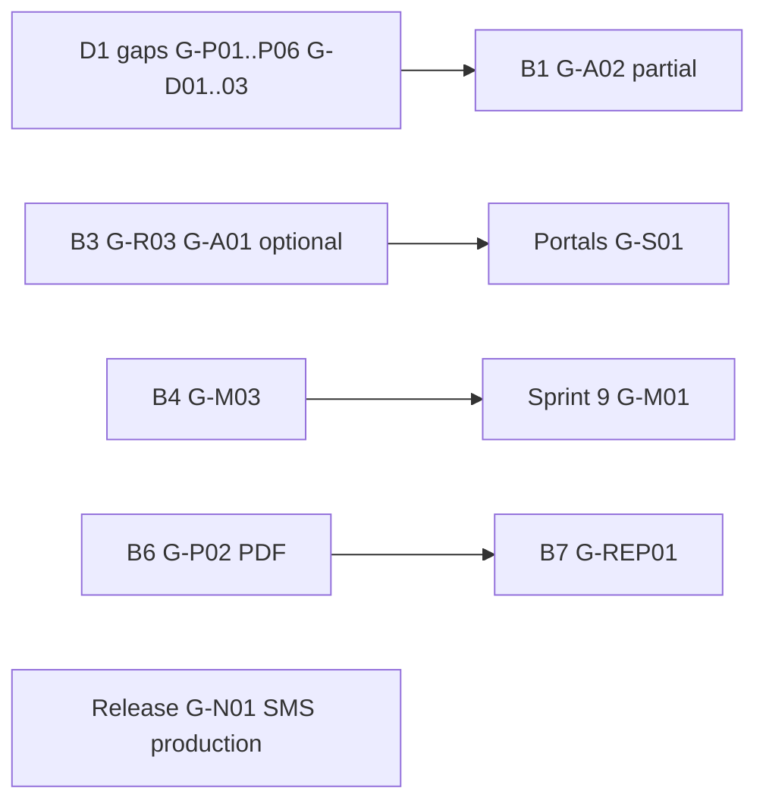

# Gap Analysis Report

**Project:** Aarvii CCTV AMC Management System  
**Phase:** D1-0 — Architecture Validation & Readiness Review  
**Scope:** Identify gaps between frozen requirements, D0 design, and Platform V1 capabilities  
**Rule:** No requirement changes; gaps classified for implementation planning only

---

## 1. Summary

| Category | Critical | High | Medium | Low | Total |
|----------|:--------:|:----:|:------:|:---:|:-----:|
| Requirements coverage | 0 | 1 | 2 | 0 | 3 |
| Screens | 0 | 0 | 1 | 1 | 2 |
| Entities | 0 | 0 | 0 | 0 | 0 |
| APIs | 0 | 1 | 1 | 1 | 3 |
| Permissions | 0 | 0 | 0 | 0 | 0 |
| Notifications | 0 | 1 | 0 | 0 | 1 |
| Reports | 0 | 0 | 0 | 1 | 1 |
| Mobile | 0 | 1 | 1 | 0 | 2 |
| Documentation | 0 | 0 | 3 | 2 | 5 |
| Platform extensions | 0 | 2 | 1 | 0 | 3 |
| **Total** | **0** | **6** | **9** | **5** | **20** |

**No Critical gaps** block D1-1 Lead Management if High gaps are addressed per conditions in final recommendation.

---

## 2. Missing or incomplete requirements coverage

| ID | Gap | Severity | Detail | Mitigation |
|----|-----|:--------:|--------|------------|
| G-R01 | Invoice Option B vs freeze §16 wording | **High** | Freeze says all invoices link to term; design implements Option B | Treat as confirmed AD; UAT tests Option B; see architecture-decision-confirmation |
| G-R02 | SMS channel not in platform | **High** | Freeze §17 mandates Email + SMS; platform is email-only | D1: `ISmsProvider` + ADR; provider selection Sprint 0 |
| G-R03 | Public AMC plan marketing | **Medium** | Website AMC page needs plan data; no anonymous API | Static content OR anonymous read endpoint in B3 (ADR) |
| G-R04 | OTP via SMS | **Medium** | Password Reset OTP, Login OTP in freeze §17 | Depends on G-R02; email fallback documented in integration-roadmap |

---

## 3. Missing screens

| ID | Gap | Severity | Detail | Mitigation |
|----|-----|:--------:|--------|------------|
| G-S01 | Admin Renewal Requests queue | **Medium** | Nav + API exist; no numbered screen in D0-5 inventory | Add screen #72 or embed in Contracts (#24) during FP-3 |
| G-S02 | D0-2 vs D0-5 inventory supersession | **Low** | Older 69-screen doc still in repo | Use D0-5 only; deprecate note in project/screen-inventory.md at D1 |

**Screens present:** 71 web (11 REUSE, 2 EXTEND, 58 NEW) · 34 mobile (8 REUSE, 1 EXTEND, 25 NEW) — **no missing freeze §2 feature screens** except G-S01 admin queue.

---

## 4. Missing entities

| ID | Gap | Severity | Detail |
|----|-----|:--------:|--------|
| — | None identified | — | 32 entities cover all freeze §5–§16 domains |

Entity model is **complete** for V1. Reporting and portals correctly own no entities.

---

## 5. Missing APIs

| ID | Gap | Severity | Detail | Mitigation |
|----|-----|:--------:|--------|------------|
| G-A01 | Anonymous AMC plans read | **High** | Public website AMC Services page | See G-R03 |
| G-A02 | CCTV module routes (all) | **High** | ~115 routes designed, **zero implemented** | Expected — D1-1+ implementation |
| G-A03 | Audit log query (real data) | **Medium** | Platform stub returns empty | Business history entities; optional platform Phase 2 |
| G-A04 | Route count reconciliation | **Low** | Summary ~115 vs line sum ~118 | Doc hygiene only |

**API design completeness:** Endpoint catalog covers all screen actions, workflows, and mobile consumption paths.

---

## 6. Missing permissions

| ID | Gap | Severity | Detail | Mitigation |
|----|-----|:--------:|--------|------------|
| — | Seed data not deployed | **High** (implementation) | 30 NEW permissions designed, not in DB | D1 RBAC seed migration |
| — | Permission design gap | — | None | Permission catalog complete |

---

## 7. Missing notifications

| ID | Gap | Severity | Detail | Mitigation |
|----|-----|:--------:|--------|------------|
| G-N01 | SMS provider + templates | **High** | 11 events mapped; SMS channel absent in platform | D1 stub + B1+ handlers for email; SMS when provider ready |
| G-N02 | CCTV email templates | **Medium** | Platform templates exist; CCTV-specific copy not created | D1 placeholders; B1+ per notification-mapping.md |

**Event → channel mapping:** Complete in notification-mapping.md for all 11 freeze §17 events.

---

## 8. Missing reports

| ID | Gap | Severity | Detail | Mitigation |
|----|-----|:--------:|--------|------------|
| G-REP01 | Report implementation | **Low** (expected) | 6 admin reports + dashboards designed; B7 phase | Per report-specification.md |
| G-REP02 | Chart library | **Low** | Dashboards use cards/tables only | By design — no gap vs freeze |

---

## 9. Missing mobile capabilities

| ID | Gap | Severity | Detail | Mitigation |
|----|-----|:--------:|--------|------------|
| G-M01 | CCTV feature slices | **High** (expected) | All 25 NEW mobile screens unbuilt | Sprint 9 per sprint-plan |
| G-M02 | OpenAPI Dart SDK for CCTV | **Medium** | Platform SDK partial; CCTV routes not generated | D1 CI OpenAPI export; regen on API change |
| G-M03 | Engineer offline sync API | **High** (expected) | `POST /engineer/visits/sync` designed, not built | B4 + Sprint 9 |

**Mobile foundation:** Auth, files, offline cache, push, release CI — **EXISTS** in Platform V1.

---

## 10. Missing documentation

| ID | Gap | Severity | Detail | Mitigation |
|----|-----|:--------:|--------|------------|
| G-D01 | CCTV module docs (7-file) | **Medium** | `docs/modules/cctv-*` not created | D1 deliverable |
| G-D02 | CCTV ADRs (SMS, PDF) | **Medium** | Decisions referenced, ADRs not filed | D1 deliverable |
| G-D03 | module-map.md CCTV entries | **Medium** | Architecture map lacks CCTV modules | D1 update |
| G-D04 | Admin screen count in reuse-roadmap | **Low** | "38 admin" vs 28 business + 7 REUSE | Doc reconcile |
| G-D05 | D1-0 review pack | **Low** | This review (now complete) | Done |

---

## 11. Platform extension gaps (not missing modules)

| ID | Gap | Severity | Platform area | Mitigation |
|----|-----|:--------:|---------------|------------|
| G-P01 | SMS integration | **High** | Notifications EXTEND | D1 interface + ADR |
| G-P02 | PDF generation service | **High** | NEW in CCTV (not platform) | D1 interface; B3/B4/B6 delivery |
| G-P03 | RBAC role/permission seeds | **High** | Auth EXTEND | D1 migration |
| G-P04 | Webhook catalog entries | **Medium** | Webhooks EXTEND | D1 + per-phase event registration |
| G-P05 | Portal route trees | **Medium** | Frontend EXTEND | D1 skeleton |
| G-P06 | CCTV email templates | **Medium** | Notifications EXTEND | D1 placeholders |

---

## 12. Gap closure sequence

---

## 13. Conclusion

Gaps are **expected pre-implementation state** — design is complete; code and seeds are not. No missing entities or permission design. Highest priority closures: **D1 platform wiring (SMS stub, PDF stub, RBAC seeds, module docs)** before B1 merge.

---

Related: [architecture-validation-report.md](./architecture-validation-report.md) · [platform-reuse-validation.md](./platform-reuse-validation.md)
