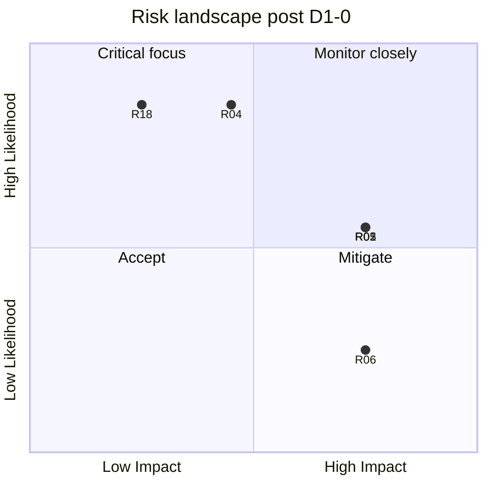

# Risk Reassessment

**Project:** Aarvii CCTV AMC Management System  
**Phase:** D1-0 — Review of D0-8 risk register against validation findings  
**Baseline:** [risk-register.md](../roadmap/risk-register.md) (20 risks R01–R20)

---

## 1. Executive summary

| Category | Open | Mitigating | New (D1-0) | Closed |
|----------|:----:|:----------:|:----------:|:------:|
| Architecture | 1 | 2 | 1 | 0 |
| Technical | 8 | 2 | 0 | 0 |
| Business | 3 | 0 | 0 | 0 |
| Operational | 3 | 0 | 0 | 0 |
| Mobile | 2 | 0 | 0 | 0 |
| Deployment | 2 | 0 | 0 | 0 |
| Data migration | 0 | 0 | 0 | 1 |

**Top risks unchanged:** R01 conversion orchestration, R02 offline sync, R04 SMS provider, R05 scope creep, R06 platform modification pressure.

**New risk R21:** Doc traceability (Option B vs freeze wording) — mitigated via architecture-decision-confirmation.

---

## 2. Architecture risks

| ID | Risk | Prior | Post D1-0 | Mitigation status |
|----|------|:-----:|:---------:|-------------------|
| R06 | Platform code modification | H/L | **Confirmed** | Architecture tests + PR checklist — no incidents in review |
| R19 | Cross-team API bottleneck | M/M | **Confirmed** | Contract-first; OpenAPI in PR |
| **R21** | **Design vs freeze traceability gaps** | — | **M/M NEW** | AD confirmation doc; UAT uses design not stale BRD text |

---

## 3. Technical risks

| ID | Risk | Prior | Post D1-0 | Change |
|----|------|:-----:|:---------:|--------|
| R01 | Lead conversion failure | H/M | **Unchanged — #1** | Outbox + idempotent contracts — design validated in dependency-validation |
| R02 | Offline sync conflicts | H/M | **Unchanged — #2** | Server-wins + clientCorrelationId — mobile-api-consumption validated |
| R03 | PDF library delay | M/M | **Monitoring** | D1 ADR mandatory — added to GO conditions |
| R04 | SMS provider not selected | M/H | **Unchanged — #5** | D1 ISmsProvider — highest pre-code risk |
| R07 | Audit read stub | L/H | **Accepted** | Business histories sufficient for V1 — gap-analysis G-A03 |
| R10 | Visit photo metadata perf | M/M | **Confirmed** | Indexing in database-implementation-plan |
| R12 | OpenAPI/SDK drift | M/M | **Confirmed** | D1 CI export — GO condition |
| R14 | Schedule generation edge cases | M/M | **Confirmed** | B3–B4 test matrix |
| R18 | Option B vs BR-INV-02 | L/H | **Mitigating** | Documented as confirmed AD — R21 related |

---

## 4. Business risks

| ID | Risk | Prior | Post D1-0 | Change |
|----|------|:-----:|:---------:|--------|
| R05 | Scope creep | H/M | **Unchanged — #3** | Freeze §22 CR process — no new modules in design |
| R11 | UAT gap vs freeze | M/M | **Monitoring** | UAT script must reference design pack + Option B |
| R18 | Invoice wording | L/H | **Mitigating** | See architecture-decision-confirmation |

---

## 5. Operational risks

| ID | Risk | Prior | Post D1-0 | Change |
|----|------|:-----:|:---------:|--------|
| R07 | Audit forensics limited | L/H | **Accepted** | See technical R07 |
| R13 | Engineer evidence adoption | M/M | **Confirmed** | Server-side validation BR-VISIT-01 |
| R20 | Insufficient QA time | M/M | **Confirmed** | Sprint 11 buffer adequate |

---

## 6. Mobile risks

| ID | Risk | Prior | Post D1-0 | Change |
|----|------|:-----:|:---------:|--------|
| R02 | Sync conflicts | H/M | See technical | — |
| R09 | App store rejection | M/L | **Confirmed** | Platform store-readiness REUSE |
| R17 | Offline queue data loss | H/M | **Confirmed** | Platform offline cache REUSE |

---

## 7. Deployment risks

| ID | Risk | Prior | Post D1-0 | Change |
|----|------|:-----:|:---------:|--------|
| R08 | Migration failure | H/L | **Confirmed** | Additive-only; rollback runbook in release-plan |
| R15 | Redis/Mongo outage | M/L | **Confirmed** | Platform ops runbooks |
| R16 | Legacy data migration | L/— | **Closed** | Greenfield CCTV — no ETL |

---

## 8. Risk priority after D1-0

| Rank | ID | Action before B1 |
|:----:|----|-----------------|
| 1 | R04 | SMS ADR + stub interface (D1) |
| 2 | R03 | PDF ADR + stub interface (D1) |
| 3 | R12 | OpenAPI CI export (D1) |
| 4 | R06 | Architecture test projects (D1) |
| 5 | R21 | Publish architecture-decision-confirmation (D1-0 — done) |

---

## 9. Risk trend

---

## 10. Conclusion

D1-0 validation **does not introduce new Critical risks**. Existing roadmap mitigations remain valid. One new Medium risk (R21 traceability) addressed in this review pack. **Proceed with D1 conditions** in final recommendation.

---

Related: [risk-register.md](../roadmap/risk-register.md) · [final-implementation-recommendation.md](./final-implementation-recommendation.md)
