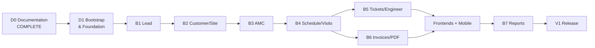
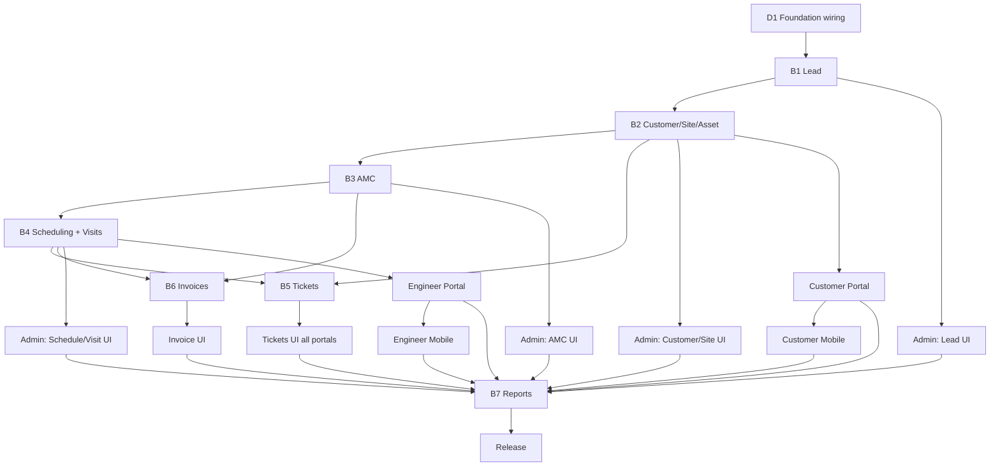

# Implementation Roadmap

**Project:** Aarvii CCTV AMC Management System
**Phase:** D0-8 — Implementation Roadmap, Development Sequencing & Delivery Plan
**Baseline:** Ashraak Enterprise Platform V1 (frozen) · CCTV = business modules only
**Design authority:** `docs/project/design/` + `docs/project/design/lld/` (D0-4 through D0-7 complete)

> This roadmap schedules **CCTV business functionality only**. Platform capabilities (Auth, Files, Notifications, Audit, Webhooks, Theme Engine, Flutter foundation, CI/CD) are **already delivered** — wired, not rebuilt.

---

## 1. Program timeline (high level)

| Phase | Name | Duration (indicative) | Complexity |
|-------|------|----------------------:|:----------:|
| **D0** | Documentation & design | ✅ Complete | — |
| **D1** | Bootstrap & platform wiring | 2–3 weeks | M |
| **B1** | Lead Management | 2–3 weeks | M |
| **B2** | Customer · Site · Asset | 3–4 weeks | M |
| **B3** | AMC Plans · Contracts · Terms | 4–5 weeks | **L** |
| **B4** | Scheduling · Visits · Approval | 5–6 weeks | **L** |
| **B5** | Tickets · Engineer ops | 3–4 weeks | M |
| **B6** | Invoices · PDF generation | 3–4 weeks | M |
| **FP** | Admin + Customer + Engineer portals (parallel tracks) | 6–8 weeks | **L** |
| **M** | Mobile apps (Customer + Engineer) | 4–5 weeks | L |
| **B7** | Reports · hardening | 2–3 weeks | M |
| **REL** | QA · UAT · Production | 2–3 weeks | M |

**Total indicative:** ~32–40 person-weeks (team-parallelizable; calendar ~6–9 months with 2–3 devs).

---

## 2. Milestones

| # | Milestone | Gate | Target outcome |
|---|-----------|------|----------------|
| M0 | D0 design complete | All D0-4..8 docs approved | ✅ Done |
| M1 | Foundation ready | D1 exit ([phase-execution-playbook.md](./phase-execution-playbook.md)) | Build green; roles seeded; CCTV host registered |
| M2 | Lead-to-customer path | B1+B2 exit | Website inquiry → lead → convert → customer/site |
| M3 | AMC live | B3 exit | Plans, contracts, terms, renewal request |
| M4 | Field operations | B4 exit | Auto schedules, visit evidence, admin approval |
| M5 | Service desk | B5 exit | Full ticket lifecycle |
| M6 | Billing | B6 exit | Invoice Option B + 3 PDF types |
| M7 | Portals complete | FP exit | Admin end-to-end; customer & engineer self-service |
| M8 | Mobile complete | M exit | Both apps per freeze §18; engineer offline verified |
| M9 | V1 release | REL exit | Reports live; UAT sign-off; production deploy |

---

## 3. Dependency graph (critical path)

**Critical path:** D1 → B1 → B2 → B3 → B4 → (B6 invoices need visits/tickets optional) → FP integration → B7 → REL

**Parallelizable after B2:** Engineer master (B5), partial admin UI, public website forms

**Parallelizable after B4:** Customer portal, Engineer portal, mobile tracks

---

## 4. Workstreams (what is NOT scheduled)

These exist in Platform V1 — **zero implementation sprints**:

| Platform capability | Status | CCTV action |
|--------------------|--------|-------------|
| Auth / MFA / Sessions | ✅ Done | Wire roles only (D1) |
| RBAC machinery | ✅ Done | Seed permissions (D1) |
| Files module | ✅ Done | Consume API |
| Notifications (email) | ✅ Done | Templates + handlers |
| Audit observer | ✅ Done | Register DbContext interceptor |
| Webhooks engine | ✅ Done | Catalog entries + publishers |
| ApiKeys | ✅ Done | Use for integrations |
| Theme Engine + platform-ui | ✅ Done | Build CCTV pages on primitives |
| Flutter foundation | ✅ Done | CCTV feature slices |
| CI/CD (5 pipelines) | ✅ Done | Extend for CCTV modules |

See [platform-reuse-roadmap.md](./platform-reuse-roadmap.md).

---

## 5. Risk areas (summary)

| Area | Impact | Mitigation doc |
|------|--------|----------------|
| Lead conversion orchestration | High | Outbox + contract tests; B1 gate |
| Visit offline sync | High | Idempotent sync API; dedicated mobile sprint |
| PDF generation | Medium | Early spike in B6; QuestPDF/iText POC in D1 |
| SMS provider selection | Medium | Abstract `ISmsProvider`; config-driven |
| AMC term → schedule generation | Medium | Event-driven; integration tests B3→B4 |
| Scope creep | High | Change request only (freeze §22) |
| Platform modification temptation | High | Architecture tests + freeze policy |

Full register: [risk-register.md](./risk-register.md)

---

## 6. Complexity by domain

| Domain | Complexity | Primary reason |
|--------|:----------:|----------------|
| Lead | M | Conversion orchestration across modules |
| Customer/Site/Asset | M | Aggregates, max-3 contacts |
| AMC | **L** | Master+terms, versioning, renewal |
| Scheduling | M | Auto-generation from plan frequency |
| Visits | **L** | Evidence checklist, approval, offline |
| Tickets | M | Tri-actor, reopen, timelines |
| Engineer | S | Master + workload reads |
| Invoices | M | Option B + PDF |
| Reporting | M | Read models across modules |
| Admin UI | **L** | 38 business screens |
| Customer UI | M | 13 screens, scoped reads |
| Engineer UI | M | Visit reporting UX |
| Mobile | **L** | Offline engineer path |

---

## 7. Document map (implementation authority)

| Topic | Document |
|-------|----------|
| Backend sequencing | [backend-development-phases.md](./backend-development-phases.md) |
| Frontend sequencing | [frontend-development-phases.md](./frontend-development-phases.md) |
| Mobile sequencing | [mobile-development-phases.md](./mobile-development-phases.md) |
| Database rollout | [database-implementation-plan.md](./database-implementation-plan.md) |
| Integrations | [integration-roadmap.md](./integration-roadmap.md) |
| Testing | [testing-roadmap.md](./testing-roadmap.md) |
| Release | [release-plan.md](./release-plan.md) |
| Sprints | [sprint-plan.md](./sprint-plan.md) |
| Gates | [phase-execution-playbook.md](./phase-execution-playbook.md) |
| DoD | [definition-of-done.md](./definition-of-done.md) |

---

## 8. Exit statement

When M9 is complete:

- All freeze §2–§20 requirements delivered via CCTV business modules
- No duplicate platform capabilities
- Module docs + ADRs per governance
- UAT sign-off recorded
- V1 tagged and deployed

**Next step after D0-8:** **D1 Development Planning & Module Implementation** — execute Sprint 0 (D1 foundation) per [sprint-plan.md](./sprint-plan.md).

---

Related: [project-roadmap.md](../project-roadmap.md) (original D0–D7 vision) · [platform-reuse-analysis.md](../design/platform-reuse-analysis.md)
