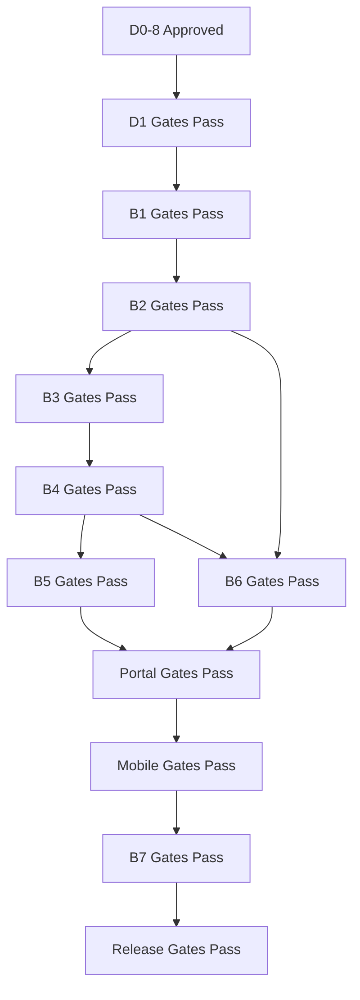

# Phase Execution Playbook

**Project:** Aarvii CCTV AMC Management System
**Phase:** D0-8 — **most important delivery document**
**Rule:** **No phase may start until all prior-phase gates are completed and signed off.**

Each gate references [definition-of-done.md](./definition-of-done.md) and [documentation-governance.md](../../documentation-governance.md).

---

## Review Gate 1 — D1-1 through D1-5 (implementation waves)

**Applies to:** D1-1 Lead · D1-2 Customer · D1-3 Site · D1-4 AMC · D1-5 Scheduling & Visits

Implementation work **must not block** on full test execution during these phases. Create tests where appropriate; **running** unit, integration, E2E, and frontend test suites is **deferred** until **Review Gate 2** (after D1-5).

### Phase exit criteria (each D1-n)

| # | Criterion | Verification |
|---|-----------|--------------|
| 1 | **Restore** | `dotnet restore` on host/API project succeeds |
| 2 | **Build** | `dotnet build` succeeds (Release or Debug) |
| 3 | **Architecture** | No layer/module boundary violations — `Ashraak.Architecture.Tests` pass |
| 4 | **Documentation** | Module 7-file docs updated; `docs/index.md` if new sections; phase completion report |
| 5 | **Completion report** | `docs/project/sprint-*` or `d1-*-completion-report.md` published |

### Explicitly deferred to Review Gate 2

- Unit test execution (domain, validators)
- Integration / API test execution
- Frontend component / E2E test execution
- Full CI test stage
- UAT / manual test sign-off

---

## Review Gate 2 — After D1-5 (full test execution)

**Prerequisite:** D1-1 through D1-5 each signed off under Review Gate 1.

| # | Criterion |
|---|-----------|
| 1 | Execute full test pyramid per [testing-roadmap.md](./testing-roadmap.md) |
| 2 | All tests created in D1-1..D1-5 phases run green |
| 3 | Cross-module scenarios (e.g. lead conversion B1→B2→B3) |
| 4 | CI test stage enabled and green |
| 5 | Review Gate 2 sign-off before D1-6+ (Tickets, Invoices, Portals) |

---

## Gate types (all phases)

| Gate | Pass criteria |
|------|---------------|
| **Architecture** | No Core platform code changes; layer boundary tests green; contracts-only cross-module refs |
| **Documentation** | Module 7-file docs updated; ADR if significant decision; OpenAPI metadata complete |
| **Testing** | See **Review Gate 1** (D1-1..D1-5) or **Review Gate 2** (after D1-5) — [below](#review-gate-1--d1-1-through-d1-5-implementation-waves) |
| **Review** | PR approved by tech lead; traceability to freeze doc |
| **Release** | Merged to `main`; CI green; deployable to dev environment |

---

## Phase D1 — Bootstrap & Foundation Wiring

**Prerequisite:** D0-8 approved (this delivery)

| | |
|-|-|
| **Inputs** | Approved design pack (D0-4..7); Platform V1 repo; dev environment |
| **Outputs** | Empty CCTV module skeletons registered; roles/permissions seeded; portal routes; SMS/PDF stubs; CI extended |
| **Documents required** | `docs/modules/cctv-*` README stubs; ADR for SMS provider choice; updated `module-map` |
| **Architecture gate** | Host Layer 2 registration only; no Auth/Files code changes |
| **Documentation gate** | Module folder structure per governance |
| **Testing gate** | Architecture tests for new projects; smoke test `/api/v1/cctv/health` |
| **Release gate** | CI green on `main` |

---

## Phase B1 — Lead Management (D1-1)

| | |
|-|-|
| **Inputs** | D1 complete; `cctv_lead` schema design |
| **Outputs** | Lead module + inquiry API; conversion command (partial until B3); admin lead UI; events |
| **Documents** | Full 7-file `docs/modules/cctv-lead/`; update event-catalog |
| **Architecture gate** | Lead owns `cctv_lead` only; conversion via contracts |
| **Documentation gate** | api.md matches endpoint-catalog |
| **Testing gate (Review Gate 1)** | Tests **created** (domain, integration stubs); execution **deferred**. Architecture tests **pass**. |
| **Review gate** | Review Gate 1 sign-off — build + restore + architecture + completion report |
| **Release gate** | Deploy dev; demo lead pipeline (manual OK until Review Gate 2) |

**Blocks:** B2, public inquiry forms in production

---

## Phase B2 — Customer · Site · Asset (D1-2 · D1-3)

| | |
|-|-|
| **Inputs** | B1 complete |
| **Outputs** | `cctv_customer` module; customer/site/asset APIs; portal profile API |
| **Documents** | `docs/modules/cctv-customer/` |
| **Architecture gate** | Max-3 contacts enforced in aggregate |
| **Testing gate (Review Gate 1)** | Tests created; execution deferred. Architecture tests pass. |
| **Review gate** | Review Gate 1 sign-off per D1-2 / D1-3 |
| **Release gate** | Lead conversion creates real customer+site (wiring; full verify at Review Gate 2) |

**Blocks:** B3, customer portal data

---

## Phase B3 — AMC Plans · Contracts · Terms (D1-4)

| | |
|-|-|
| **Inputs** | B2 complete |
| **Outputs** | `cctv_amc` module; plan versioning; master+terms; renewal request; expiry job |
| **Documents** | `docs/modules/cctv-amc/` |
| **Architecture gate** | One active contract per site (DB + domain) |
| **Testing gate (Review Gate 1)** | Tests created; execution deferred. Architecture tests pass. |
| **Review gate** | Review Gate 1 sign-off — D1-4 |
| **Release gate** | Full lead conversion including initial contract (wiring; full verify at Review Gate 2) |

**Blocks:** B4 (schedule source), B6 (AMC invoices)

---

## Phase B4 — Scheduling · Visits · Approval (D1-5)

| | |
|-|-|
| **Inputs** | B3 complete; Engineer master minimal (or B5 engineer read stub) |
| **Outputs** | `cctv_service` module; schedules; visit execution; approval; visit PDF trigger |
| **Documents** | `docs/modules/cctv-service/` |
| **Architecture gate** | BR-VISIT-01 server-side enforcement |
| **Testing gate (Review Gate 1)** | Tests created; execution deferred. Architecture tests pass. |
| **Review gate** | Review Gate 1 sign-off — D1-5; then **Review Gate 2** full test execution |
| **Release gate** | End-to-end visit on dev (manual OK until Review Gate 2) |

**Blocks:** Engineer portal, mobile visit flow, B6 visit-linked invoices

---

## Phase B5 — Tickets · Engineer Operations

| | |
|-|-|
| **Inputs** | B2 complete; B4 recommended for visit-originated tickets |
| **Outputs** | `cctv_ticket`, `cctv_engineer` modules; ticket lifecycle; engineer master |
| **Documents** | `docs/modules/cctv-ticket/`, `cctv-engineer/` |
| **Testing gate** | Tri-actor create; reopen; assignment notifications |
| **Review gate** | BR-TKT-01..06, BR-VISIT-07 |
| **Release gate** | Ticket workflows live |

**Blocks:** Ticket UI all portals

---

## Phase B6 — Invoices · PDF Generation

| | |
|-|-|
| **Inputs** | B3 + B2; optional B4/B5 refs |
| **Outputs** | `cctv_invoice` module; PDF service (3 doc types); invoice lifecycle |
| **Documents** | `docs/modules/cctv-invoice/`; PDF ADR |
| **Architecture gate** | Option B rules; Files storage only |
| **Testing gate** | V-INV-*; PDF generation smoke |
| **Review gate** | BR-INV-01..05 (Option B) |
| **Release gate** | Invoice PDF downloadable |

**Blocks:** Customer invoice views, revenue report

---

## Phase FP — Frontend Portals (parallel tracks)

### FP-A Admin (incremental with B1–B6)

| Gate | Per sprint deliverable matching backend phase |
|------|-----------------------------------------------|
| Architecture | platform-ui only ([theme-usage-design.md](../design/lld/theme-usage-design.md)) |
| Documentation | Screen notes in module README if needed |
| Testing | Component tests + E2E critical paths |
| Review | Match [screen-design-specification.md](../design/lld/screen-design-specification.md) |

### FP-C Customer Portal (Sprint 7)

**Prerequisite:** B2, B3, B4, B5, B6 APIs for dashboard features

### FP-E Engineer Portal (Sprint 8)

**Prerequisite:** B4, B5 APIs

---

## Phase M — Mobile Apps (Sprint 9)

| | |
|-|-|
| **Inputs** | FP-C + FP-E APIs stable; OpenAPI SDK regenerated |
| **Outputs** | Customer + Engineer apps feature-complete per §18 |
| **Architecture gate** | No hand-written DTOs; offline sync for engineer only |
| **Testing gate** | Offline sync test suite; device matrix smoke |
| **Review gate** | [mobile-screen-design.md](../design/lld/mobile-screen-design.md) |
| **Release gate** | Fastlane beta build |

**Prerequisite:** B4 minimum for engineer app

---

## Phase B7 — Reports · Hardening (Sprint 10)

| | |
|-|-|
| **Inputs** | All modules + portals functional |
| **Outputs** | Reporting module; dashboard widgets; performance fixes |
| **Documents** | `docs/modules/cctv-reporting/` |
| **Testing gate** | Report API tests; UAT script pass |
| **Release gate** | V1 candidate tag |

---

## Phase REL — QA · UAT · Production

See [release-plan.md](./release-plan.md).

| Gate | Criteria |
|------|----------|
| QA complete | All test tiers pass ([testing-roadmap.md](./testing-roadmap.md)) |
| UAT sign-off | Business acceptance against freeze §2 |
| Production | Deploy runbook; rollback tested |
| Documentation | `docs/index.md` current; release notes published |

---

## Phase dependency enforcement

**Waivers:** Only via written change request with explicit risk acceptance — never for platform freeze violations.

---

## Sign-off template (per phase)

### Review Gate 1 (D1-1 … D1-5)

| Field | Value |
|-------|-------|
| Phase | D1-1 |
| Date | |
| Restore | ☐ Pass |
| Build | ☐ Pass |
| Architecture | ☐ Pass |
| Documentation | ☐ Pass |
| Completion report | ☐ Published |
| Tests created (not executed) | ☐ |
| Approver | |

### Review Gate 2 (after D1-5)

| Field | Value |
|-------|-------|
| Date | |
| Unit tests | ☐ Pass |
| Integration tests | ☐ Pass |
| E2E / frontend tests | ☐ Pass |
| CI test stage | ☐ Green |
| Approver | |

### Standard phase (B5+ / REL)

| Field | Value |
|-------|-------|
| Phase | B4 |
| Date | |
| Architecture | ☐ Pass |
| Documentation | ☐ Pass |
| Testing | ☐ Pass |
| Review | ☐ Pass |
| Release (dev) | ☐ Pass |
| Approver | |

---

Related: [implementation-roadmap.md](./implementation-roadmap.md) · [sprint-plan.md](./sprint-plan.md) · [definition-of-done.md](./definition-of-done.md)
