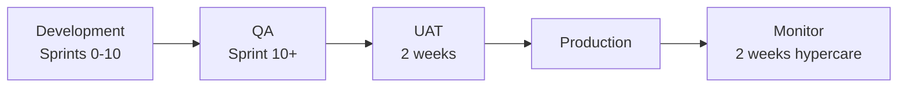

# Release Plan

**Project:** Aarvii CCTV AMC Management System
**Phase:** D0-8
**Versioning:** Semantic versioning for CCTV application releases · API `/api/v1/` frozen for V1

---

## 1. Environments

| Environment | Purpose | Deploy trigger |
|-------------|---------|----------------|
| **Local** | Developer | Manual |
| **Dev** | Integration | Merge to `main` |
| **Staging** | QA + UAT | Release candidate tag |
| **Production** | Live Aarvii | Approved UAT + change window |

Platform environments share same host — CCTV modules deploy with Ashraak.Api.

---

## 2. Release phases

### Development (Sprints 0–10)

- Continuous deploy to **dev** on merge
- Feature flags optional for incomplete modules ([platform feature-flags](../../platform/feature-flags/README.md))
- Internal demos at end of each sprint

### QA (2–3 weeks, overlaps Sprint 10)

| Activity | Owner |
|----------|-------|
| Full automated regression | QA/Dev |
| Manual exploratory | QA |
| Performance smoke (key APIs) | Dev |
| Security scan (dependencies) | CI |
| Mobile beta (TestFlight/Internal track) | Mobile |

**Exit:** Zero P0/P1 bugs open

### UAT (2 weeks)

| Activity | Detail |
|----------|--------|
| Business script execution | All freeze §2 features |
| Realistic data | Staging seed |
| Sign-off document | Product owner approval |

**Exit:** UAT sign-off recorded

### Production

| Step | Detail |
|------|--------|
| Pre-deploy | DB backup; migration review |
| Deploy | Blue/green or rolling (ops standard) |
| Smoke | Login, inquiry, lead, visit, invoice paths |
| Monitor | 48h elevated monitoring |

---

## 3. Versioning strategy

| Artifact | Version |
|----------|---------|
| Application | `1.0.0` at V1 go-live |
| API | URL `/api/v1/` — breaking → v2 only via change request |
| Mobile apps | `version.yaml` per platform mobile manifest |
| OpenAPI | Tagged with app version |
| Database | EF migration sequence — additive only V1 |

**Tags:** `cctv-v1.0.0` on git; mobile store version aligned.

---

## 4. Release checkpoints

| Checkpoint | Criteria |
|------------|----------|
| RC1 | All sprints complete; feature freeze |
| RC2 | QA pass |
| RC3 | UAT pass |
| GA | Production deploy + release notes |

---

## 5. Rollback strategy

| Component | Rollback |
|-----------|----------|
| Application | Redeploy previous container/image |
| Database | Forward-fix preferred; restore backup if migration failure |
| Mobile | Store rollback to previous version (platform process) |
| Feature flags | Disable CCTV routes if catastrophic |

**RTO target:** 4 hours (business agreement)  
**RPO target:** 24 hours (daily backup)

---

## 6. Release artifacts

| Artifact | Location |
|----------|----------|
| Release notes | `docs/project/releases/v1.0.0-release-notes.md` (create at GA) |
| Migration runbook | `docs/modules/cctv-*/operations.md` |
| UAT sign-off | Project records |
| OpenAPI snapshot | Committed / CI artifact |
| Mobile builds | Store + internal artifact repo |

---

## 7. CI/CD (REUSE platform pipelines)

| Pipeline | CCTV extension |
|----------|----------------|
| `ci.yml` | Add CCTV test projects; EF migrate test |
| `docs-validation.yml` | CCTV module docs |
| `mobile.yml` | CCTV feature tests |
| `android-release.yml` / `ios-release.yml` | CCTV app flavors |

**No new pipeline** unless mobile apps split to separate store listings requiring dedicated workflow.

---

## 8. Post-V1

| Item | Handling |
|------|----------|
| Defects | Patch releases `1.0.x` |
| Enhancements | Change request → V1.1 roadmap |
| Payment gateway | Post-V1 phase ([integration-roadmap.md](./integration-roadmap.md)) |

---

Related: [sprint-plan.md](./sprint-plan.md) · [risk-register.md](./risk-register.md) · [definition-of-done.md](./definition-of-done.md)
