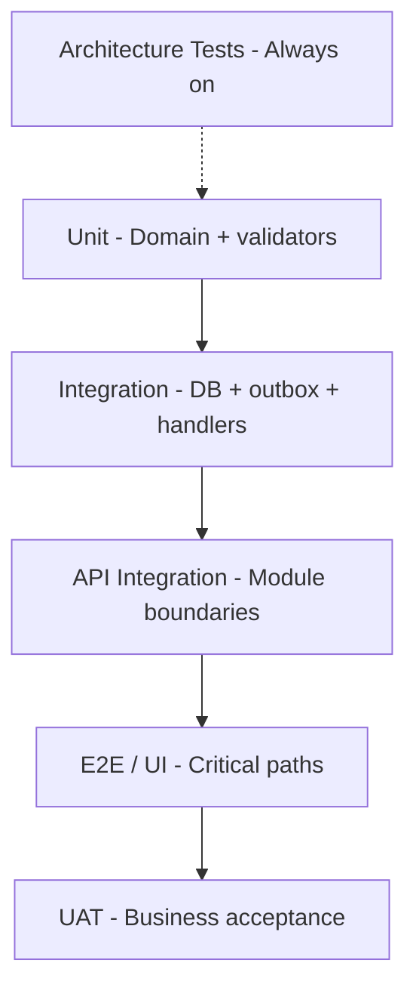

# Testing Roadmap

**Project:** Aarvii CCTV AMC Management System
**Phase:** D0-8
**Principle:** Test CCTV business logic thoroughly; **do not re-test frozen platform modules** except integration touchpoints.

### Review Gate 1 vs Review Gate 2

| Phase range | Test creation | Test execution |
|-------------|---------------|----------------|
| **D1-1 … D1-5** (Review Gate 1) | Required where appropriate | **Deferred** (except architecture tests) |
| **After D1-5** (Review Gate 2) | Complete any gaps | **Required** — full pyramid below |

Architecture tests (`Ashraak.Architecture.Tests`) run at every D1-n exit. Unit, integration, API, E2E, and frontend tests are written during D1-1..D1-5 but executed in bulk at Review Gate 2.

---

## 1. Test pyramid

---

## 2. Unit testing

| Target | Framework | When |
|--------|-----------|------|
| Domain aggregates (status transitions, invariants) | xUnit + FluentAssertions | Each backend phase |
| FluentValidation validators | xUnit | Each API phase |
| Zod schemas (frontend) | Vitest | Each frontend phase |
| Flutter form validators | flutter_test | Mobile sprint |
| PDF layout builders | Snapshot/unit | B6 |

**Coverage goal:** ≥80% on Domain + Application layers per module (not platform code).

**Key scenarios:** All [validation-rules.md](../design/lld/validation-rules.md) IDs with server tests.

---

## 3. Integration testing

| Target | Scope |
|--------|-------|
| DbContext + migrations | Apply migration; CRUD round-trip |
| Outbox + event handlers | Event published after SaveChanges |
| Notification handlers | Mock `INotificationService`; assert template key |
| Lead conversion | B1+B2+B3 combined test container |
| Term activation → schedules | B3→B4 handler |
| Visit checklist rejection | B4 submit without selfie → 422 |
| Invoice Option B | B6 term required for AmcRenewal type |
| File link authorization | Cross-tenant 404 |

**Infrastructure:** Testcontainers PostgreSQL; optional Mongo for audit (mock acceptable V1).

---

## 4. Architecture tests

**REUSE/EXTEND** existing `Ashraak.Architecture.Tests`:

| Rule | Enforcement |
|------|-------------|
| CCTV modules do not reference other module Infrastructure | Layer test |
| CCTV does not modify platform module namespaces | Namespace test |
| Domain has no EF/API references | Dependency test |
| Frontend CCTV modules do not import `@coreui` | ESLint rule / custom test |

Run: **every PR** in CI.

---

## 5. API testing

| Approach | Tool |
|----------|------|
| Contract tests | OpenAPI snapshot diff in CI |
| Endpoint integration | WebApplicationFactory + JWT test tokens |
| Permission matrix | Parameterized tests per [rbac-matrix.md](../design/rbac-matrix.md) |
| ProblemDetails shape | Assert 422/403/404 bodies |

**Priority endpoints:** conversion, visit submit, approve, invoice generate, offline sync batch.

Postman/Insomnia collections optional for QA manual regression.

---

## 6. UI testing (web)

| Tier | Tool | Scope |
|------|------|-------|
| Component | Vitest + Testing Library | Forms, grids, checklist widgets |
| E2E | Playwright (recommended) | 6 workflows ([workflow-screen-design.md](../design/lld/workflow-screen-design.md)) |

**E2E critical paths:**
1. Lead → convert
2. Schedule → assign → visit → approve
3. Customer ticket → reopen
4. Invoice generate → customer download
5. Admin login + permission denied
6. Engineer visit evidence (web)

**Reuse:** Do not E2E test platform auth/users/audit — smoke only.

---

## 7. Mobile testing

| Tier | Scope |
|------|-------|
| Widget tests | Checklist tiles, signature canvas |
| Integration | SDK mock server |
| Offline E2E | Engineer capture offline → sync → server accept |
| Device smoke | Android + iOS physical devices |
| Push | Staging push tap → deep link |

**REUSE:** Platform auth/files widget tests — run existing mobile CI.

---

## 8. UAT

| Aspect | Detail |
|--------|--------|
| When | Pre-production (REL phase) |
| Who | Business stakeholders + admin user |
| Script | Derived from freeze §2 features + 6 user journeys |
| Environment | Staging with realistic seed |
| Sign-off | Required for M9 ([release-plan.md](./release-plan.md)) |

---

## 9. Regression

| Trigger | Action |
|---------|--------|
| Every PR | CI unit + integration + architecture |
| Nightly | Full integration suite + E2E smoke |
| Pre-release | Full E2E + mobile offline + UAT repeat |
| Platform upgrade | Smoke platform + full CCTV regression |

**Automated regression suite** grows with each sprint — never delete tests without justification.

---

## 10. Testing schedule by sprint

| Sprint | Testing focus |
|--------|---------------|
| 0 (D1) | Architecture tests; health endpoint |
| 1 | Lead unit + inquiry integration |
| 2 | Customer/site invariants |
| 3 | AMC term activation |
| 4 | Visit checklist + approval |
| 5 | Ticket lifecycle |
| 6 | Invoice + PDF smoke |
| 7–8 | Portal E2E |
| 9 | Mobile offline |
| 10 | Reports + full regression |

---

Related: [definition-of-done.md](./definition-of-done.md) · [phase-execution-playbook.md](./phase-execution-playbook.md)
