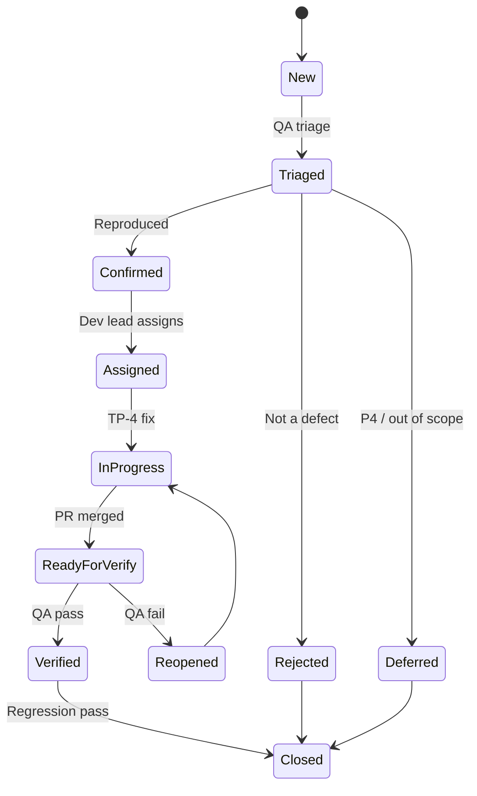

# Defect Management Process — TP-1

**Project:** Aarvii CCTV AMC Management System  
**Date:** 2026-06-12  
**Phase:** Active from TP-3 (discovery) through TP-5  
**Code freeze:** Fixes allowed in **TP-4 only** per [code-freeze-decision.md](../review/code-freeze-decision.md) §22

---

## 1. Purpose

Standardize how defects found during TP-2 through TP-5 are logged, prioritized, fixed, verified, and regression-tested — without scope creep or architecture changes.

---

## 2. Defect sources

| Source | Phase | Tool |
|--------|-------|------|
| Automated test failures | TP-2 | CI TRX / logs |
| Manual smoke checklist | TP-3 | [manual-smoke-checklist.md](./manual-smoke-checklist.md) |
| Exploratory testing | TP-3 | Ad-hoc notes → tracker |
| Fix verification | TP-4 | Retest + automated |
| Regression | TP-5 | Full suite + smoke |

**Tracker:** GitHub Issues (recommended) or project defect board — one issue per defect.

---

## 3. Severity

Severity describes **impact on users or system**, independent of fix effort.

| Severity | Code | Definition | Examples |
|----------|------|------------|----------|
| **Critical** | S1 | Production blocker; data loss; security breach; complete feature unusable | Auth bypass; invoice totals wrong; DB corruption |
| **High** | S2 | Major feature broken; no workaround | Lead conversion fails; visit cannot submit |
| **Medium** | S3 | Feature impaired; workaround exists | Report export missing column; UI layout break |
| **Low** | S4 | Minor issue; cosmetic | Typo; alignment; non-blocking validation message |

---

## 4. Priority

Priority describes **order of fix** — may differ from severity (e.g. Low severity but High priority for demo).

| Priority | Code | Target fix window |
|----------|------|-------------------|
| **P1 — Immediate** | P1 | Before TP-3 exit / before UAT |
| **P2 — High** | P2 | During TP-4 sprint |
| **P3 — Normal** | P3 | TP-4 if time permits |
| **P4 — Deferred** | P4 | Log to [deferred-items-register.md](../review/deferred-items-register.md); not fixed in V1 |

**Default mapping:**

| Severity | Default priority |
|----------|------------------|
| S1 | P1 |
| S2 | P1 or P2 |
| S3 | P2 or P3 |
| S4 | P3 or P4 |

---

## 5. Defect record template

Each defect MUST include:

| Field | Required |
|-------|:--------:|
| ID | ✅ |
| Title | ✅ |
| Severity / Priority | ✅ |
| Environment + build/tag | ✅ |
| Steps to reproduce | ✅ |
| Expected vs actual | ✅ |
| Screenshots / logs | If applicable |
| Module (Lead, Visit, etc.) | ✅ |
| Assigned to | ✅ |
| Related test case (smoke #) | If manual |
| Freeze compliance note | If fix touches code |

**Label examples:** `defect`, `severity-s2`, `module-cctv-invoice`, `tp-3`

---

## 6. Workflow

### 6.1 States

| State | Owner | Action |
|-------|-------|--------|
| **New** | QA / Dev | Log defect |
| **Triaged** | QA lead | Set severity, priority, module |
| **Confirmed** | QA | Reproduced on defined environment |
| **Assigned** | Dev lead | Developer + target TP-4 batch |
| **In Progress** | Dev | Fix under freeze rules |
| **Ready for Verify** | Dev | Deploy to test env; link PR |
| **Verified** | QA | Retest steps pass |
| **Reopened** | QA | Fix incomplete |
| **Closed** | QA lead | Regression complete |
| **Rejected** | QA lead | Not a defect (document reason) |
| **Deferred** | PM | Added to deferred register |

### 6.2 TP phase rules

| Phase | Defect activity |
|-------|-----------------|
| TP-2 | Log **test infrastructure** failures only; fix infra blockers |
| TP-3 | Log all product defects; **do not fix** (except P1 waiver by PM) |
| TP-4 | Fix P1–P3 per priority |
| TP-5 | Verify fixes; close; regression |

---

## 7. Fix verification

### 7.1 Verification steps

1. QA executes original reproduction steps on **same or newer build**  
2. QA executes related smoke checklist sections  
3. Developer confirms automated tests added/updated if applicable  
4. QA lead marks **Verified**

### 7.2 Verification fail criteria

- Original steps still fail → **Reopened**  
- Fix introduces new failure → new defect linked as **Regression**

### 7.3 Evidence

- Before/after screenshot or log snippet  
- Test run ID / CI link for automated coverage  

---

## 8. Regression rules

### 8.1 Per-fix regression (minimum)

| Fix location | Required regression |
|--------------|---------------------|
| Backend domain | Module integration tests + architecture tests |
| API contract | Integration test or smoke step |
| Web UI | Manual smoke section + `tsc`/vitest |
| Mobile | `flutter test` + manual mobile section |
| Database migration | Staging migrate + rollback check |

### 8.2 Batch regression (TP-5)

Before V1 release candidate:

| Suite | Requirement |
|-------|-------------|
| Full backend `dotnet test` | Zero failures |
| Architecture tests | Zero failures |
| Web type-check, lint, vitest, build | Green |
| Flutter analyze + test | Green |
| Full [manual-smoke-checklist.md](./manual-smoke-checklist.md) | Pass or waived |

### 8.3 Regression defect handling

- Severity **minimum S2** by default  
- Priority **P1** until resolved  
- Root cause note required in issue  

---

## 9. Freeze compliance (§22)

Allowed fixes during code freeze:

| Allowed | Not allowed |
|---------|-------------|
| Bug fixes for confirmed defects | New features |
| Test-only code (tests, fixtures) | Architecture changes |
| Config for test environments | Database redesign |
| Documentation corrections | V1.1 scope |

Every code fix PR must:

1. Reference defect ID  
2. State "freeze-compliant fix" in description  
3. Pass CI including architecture tests  
4. Receive Dev lead review  

---

## 10. Escalation

| Condition | Escalation |
|-----------|------------|
| S1 open > 24h | PM + Dev lead |
| TP-3 exit with open P1 | PM waiver or TP-4 extension |
| Fix requires schema change | **Blocked** — requires architecture CR |
| Fix matches deferred item | Close defect; update deferred register |

---

## 11. Metrics (optional)

| Metric | Target |
|--------|--------|
| Defects found TP-3 | Track only |
| P1/P2 open at TP-4 start | Trending down |
| Reopen rate | < 10% |
| Verified → Closed (TP-5) | 100% of in-scope fixes |

---

## 12. References

- [code-freeze-decision.md](../review/code-freeze-decision.md)
- [deferred-items-register.md](../review/deferred-items-register.md)
- [manual-smoke-checklist.md](./manual-smoke-checklist.md)
- [testing-phase-roadmap.md](./testing-phase-roadmap.md)

---

*TP-1 — Process defined. Active when TP-3 logging begins.*
