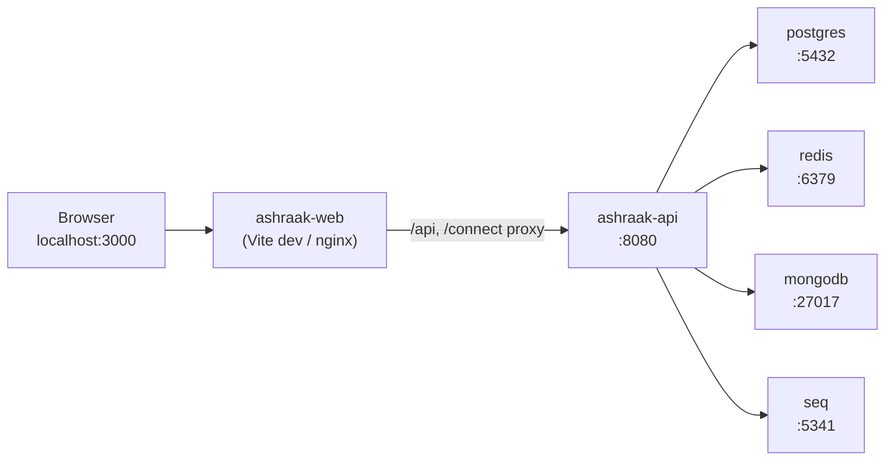

# Local Integrated Test Environment — TP-LOCAL-1

**Project:** Aarvii CCTV AMC Management System  
**Phase:** TP-LOCAL-1 — Reproducible local test environment  
**Date:** 2026-06-13  
**Status:** Environment setup complete (no smoke tests executed)

---

## 1. Purpose

Provide a **Docker-based, reproducible local environment** for manual testing of:

- PostgreSQL database (platform + CCTV schemas)
- Ashraak.Api backend (.NET 10 modular monolith)
- React web SPA (`FrontEnd/apps/web` — Vite 6, Node 20)

**Mobile (Flutter) is excluded** from this phase.

---

## 2. Architecture



### Service DNS (Docker network `ashraak-net`)

| Container | DNS name | Internal port |
|-----------|----------|---------------|
| API | `ashraak-api` | 8080 |
| Web | `ashraak-web` | 3000 (dev) / 80 (prod) |
| PostgreSQL | `postgres` | 5432 |
| Redis | `redis` | 6379 |
| MongoDB | `mongodb` | 27017 |
| Seq | `seq` | 80 (mapped to host 5341) |

---

## 3. Important: PostgreSQL (not SQL Server)

The TP-LOCAL-1 ticket references SQL Server. **This project uses PostgreSQL** (Npgsql, EF Core, schema-per-module). Migrating to SQL Server would require changes across every Infrastructure project and is **out of scope** under the code freeze.

The local environment uses the official `postgres:17-alpine` image with existing platform scripts (`BackEnd/scripts/init-db.sql`).

---

## 4. Important: React (not Angular)

The web frontend is **React 19 + Vite 6**, not Angular. Containerization uses Node 20 as specified. Environment variables use the `VITE_*` prefix (not `environment.ts`).

---

## 5. Prerequisites

| Tool | Version |
|------|---------|
| Docker Desktop / Docker Engine | 24+ with Compose V2 |
| .NET SDK | 10.0.103 (`BackEnd/global.json`) — for migrations only |
| Git | Any recent version |

Node.js and pnpm are **not required on the host** when using Docker for the web app.

---

## 6. Quick start

```powershell
# From repository root
Copy-Item .env.example .env
docker compose up -d --build
docker compose ps
```

### Verify health

```powershell
# API liveness
curl http://localhost:8080/health/live

# API readiness (all dependencies)
curl http://localhost:8080/health/ready

# Web UI
curl http://localhost:3000/
```

### Apply database migrations (first run)

```powershell
.\scripts\database\apply-migrations.ps1
```

### Load smoke-test seed data (optional)

```powershell
.\scripts\database\run-seed.ps1
```

See [smoke-test-data-guide.md](./smoke-test-data-guide.md) for entity IDs and verification queries.

---

## 7. Startup sequence

| Step | Action | Pass criteria |
|------|--------|---------------|
| 1 | `docker compose up -d` | All containers `healthy` or `running` |
| 2 | Wait for `postgres` healthy | `pg_isready` succeeds |
| 3 | Wait for `ashraak-api` healthy | `GET /health/live` → 200 |
| 4 | `ashraak-web` starts | `GET http://localhost:3000/` → 200 |
| 5 | Apply migrations | No EF errors |
| 6 | (Optional) Run seed script | Rows in CCTV tables |
| 7 | Open Scalar API docs | `http://localhost:8080/scalar/v1` |

---

## 8. Ports (default)

| Service | Host port | Env override |
|---------|-----------|--------------|
| Web SPA | 3000 | `WEB_PORT` |
| API | 8080 | `API_PORT` |
| PostgreSQL | 5432 | `POSTGRES_PORT` |
| Redis | 6379 | `REDIS_PORT` |
| MongoDB | 27017 | `MONGO_PORT` |
| Seq | 5341 | `SEQ_PORT` |
| RabbitMQ | 5672 / 15672 | `RABBITMQ_PORT` / `RABBITMQ_MGMT_PORT` |

---

## 9. Environment modes

### Development (default)

`docker-compose.override.yml` is auto-loaded:

- API built in Debug configuration
- Web runs Vite dev server with source bind-mounts for HMR
- Simple passwords (`ashraak_dev`)

### Production build (web only)

```powershell
$env:WEB_BUILD_TARGET = "production"
$env:WEB_CONTAINER_PORT = "80"
$env:WEB_PORT = "3000"
docker compose up -d --build ashraak-web
```

Production web serves static files via nginx. Set `VITE_API_BASE_URL` at build time to the API URL reachable from the browser (typically `http://localhost:8080`).

---

## 10. File layout

```
CCTVCRM/
├── docker-compose.yml              # Integrated stack (includes BackEnd compose)
├── docker-compose.override.yml     # Dev overrides
├── .env.example                    # All environment variables
├── FrontEnd/
│   ├── Dockerfile                  # Web multi-stage build
│   └── nginx.conf                  # Production SPA config
├── BackEnd/
│   ├── Dockerfile                  # API multi-stage build
│   ├── docker-compose.yml          # Backend services (included by root)
│   └── scripts/init-db.sql         # Schema bootstrap on first PG start
└── scripts/
    ├── database/
    │   ├── apply-migrations.ps1
    │   └── run-seed.ps1
    └── test-data/
        └── seed-smoke-chain.sql
```

---

## 11. Known limitations

| Limitation | Detail |
|------------|--------|
| No auto-migrate on startup | EF migrations must be applied manually via script |
| Platform Auth/Tenant/Users | Bootstrap tables from `init-db.sql`; no EF migration folders in repo |
| Test user accounts | Seed SQL inserts business entities only; Auth users require API/OTP flow or separate setup |
| RabbitMQ | Container runs but API event bus not wired |
| Mobile | Excluded from TP-LOCAL-1 |
| SQL Server | Not supported — PostgreSQL only |
| Angular | Not applicable — React/Vite stack |

---

## 12. Testing readiness

| Check | Status |
|-------|--------|
| `docker compose up` succeeds | Verify locally |
| API `/health/live` returns 200 | Verify locally |
| Web serves on port 3000 | Verify locally |
| PostgreSQL persists data (volume) | `postgres_data` volume |
| Seed script available | `scripts/test-data/seed-smoke-chain.sql` |
| Migration script available | `scripts/database/apply-migrations.ps1` |
| Documentation complete | This file + docker-setup + smoke-data guides |

**Smoke testing is NOT started in TP-LOCAL-1.** Proceed to TP-2/TP-3 per [test-execution-plan.md](./test-execution-plan.md).

---

## 13. References

- [docker-setup-guide.md](./docker-setup-guide.md)
- [smoke-test-data-guide.md](./smoke-test-data-guide.md)
- [test-environment-plan.md](./test-environment-plan.md)
- [test-data-strategy.md](./test-data-strategy.md)
- [BackEnd/DOCKER_ENVIRONMENT.md](../../BackEnd/DOCKER_ENVIRONMENT.md)
