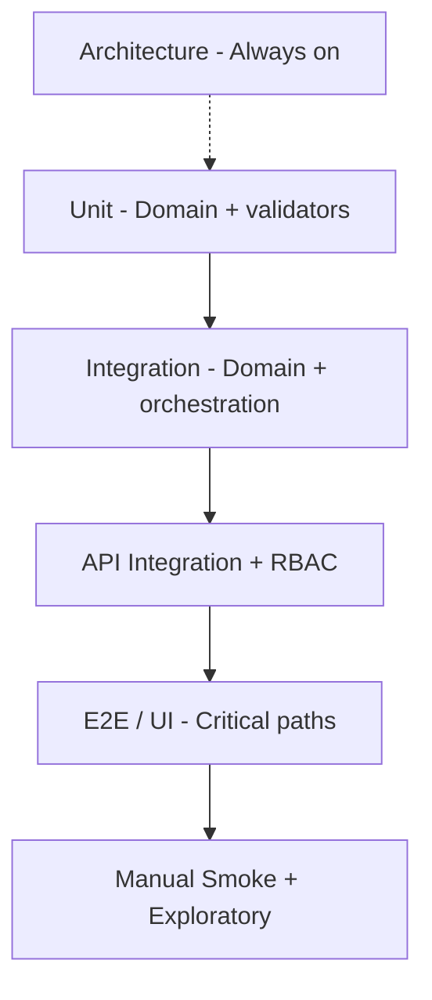

# Test Execution Plan — TP-1

**Project:** Aarvii CCTV AMC Management System  
**Date:** 2026-06-12  
**Phase:** TP-1 — Testing preparation (plan only; **no execution in this phase**)  
**Baseline:** Code freeze **APPROVED WITH CONDITIONS** ([code-freeze-decision.md](../review/code-freeze-decision.md))  
**Related:** [testing-roadmap.md](../roadmap/testing-roadmap.md) · [testing-phase-roadmap.md](./testing-phase-roadmap.md)

---

## 1. Purpose

Define **what** will be executed, **when**, **where**, and **by whom** across TP-2 through TP-5. This document is the master test plan; execution begins in **TP-2** only after [test-readiness-review.md](./test-readiness-review.md) gates are satisfied.

**Constraints (frozen):**

- No new functionality
- No architecture changes
- No database redesign
- No V1.1 work
- Defect fixes only in TP-4 per [defect-management-process.md](./defect-management-process.md)

---

## 2. Test pyramid (V1)



**Principle:** Test CCTV business logic thoroughly; **do not re-test frozen platform modules** except integration touchpoints ([testing-roadmap.md](../roadmap/testing-roadmap.md)).

---

## 3. Backend tests

### 3.1 Test projects

| Project | Scope | TP-2 execution |
|---------|-------|:--------------:|
| `Ashraak.Architecture.Tests` | Layer boundaries, naming, CCTV isolation | ✅ First |
| `Ashraak.SharedKernel.Tests` | Shared kernel primitives | ✅ |
| `Ashraak.Auth.Tests` | Auth module unit/integration | ✅ |
| `Ashraak.Users.Tests` | Users module | ✅ Smoke |
| `Ashraak.Tenant.Tests` | Tenant module | ✅ Smoke |
| `Ashraak.Audit.Tests` | Audit module | ✅ Smoke |
| `Ashraak.ApiKeys.Tests` | ApiKeys module | ✅ Smoke |
| `Ashraak.Webhooks.Tests` | Webhooks module | ✅ Smoke |
| `Ashraak.Integration.Tests` | CCTV domain + health contracts | ✅ Full CCTV suite |

### 3.2 CCTV integration test inventory

| Test file | Domain focus |
|-----------|--------------|
| `CctvHealthContractTests.cs` | API health / contract smoke |
| `LeadDomainTests.cs` | Lead pipeline invariants |
| `LeadConversionIntegrationTests.cs` | Lead → Customer + Site + AMC |
| `CustomerDomainTests.cs` | Customer CRUD rules |
| `SiteDomainTests.cs` | Site contacts, one AMC per site |
| `AmcDomainTests.cs` | Plans, contracts, terms |
| `ServiceDomainTests.cs` | Schedules, visits, evidence checklist |
| `TicketDomainTests.cs` | Ticket lifecycle, attachments |
| `EngineerDomainTests.cs` | Engineer CRUD, assignments |
| `InvoiceDomainTests.cs` | Invoice lifecycle, Option B |

### 3.3 Execution command (TP-2)

```bash
cd BackEnd
dotnet restore Ashraak.slnx
dotnet build Ashraak.slnx -c Release
dotnet test Ashraak.slnx -c Release --logger "trx;LogFileName=backend-tests.trx" --results-directory TestResults
```

**Pass criteria:** Zero failed tests; TRX artifacts archived.  
**Owner:** DevOps / QA  
**Environment:** CI (ubuntu-latest) + local developer verification  
**Maps to freeze condition:** C-03

### 3.4 Gaps (planned TP-2/TP-3, not blockers for plan)

| Gap | Target phase | Notes |
|-----|--------------|-------|
| Testcontainers DB round-trip | TP-3 | Per testing-roadmap; domain tests use mocks today |
| Notification handler integration | TP-3 | Mock `INotificationService` |
| API WebApplicationFactory JWT matrix | TP-3 | Parameterized RBAC tests |
| Wave 4 reporting pagination API tests | TP-3 | Add if missing — defect/fix via §22 only |

---

## 4. Frontend tests

### 4.1 Current inventory

| Area | Tool | Location | CCTV coverage |
|------|------|----------|---------------|
| Unit/component | Vitest | `FrontEnd/apps/web` | Platform webhooks, theme, apikeys — **minimal CCTV** |
| Type check | `tsc -b` | Build pipeline | All modules |
| Lint | ESLint | `npm run lint` | All modules |

**Scripts:**

```bash
cd FrontEnd/apps/web
npm ci
npm run type-check
npm run lint
npm run test
npm run build
```

### 4.2 TP-2 execution scope

| Tier | Action | Pass criteria |
|------|--------|---------------|
| Type check | Run on frozen branch | Zero TS errors |
| Lint | Run on frozen branch | Zero errors (warnings documented) |
| Vitest | Run existing suite | All tests pass |
| Production build | `npm run build` | Success on Node 20+ |

**Owner:** Frontend lead  
**Gap:** No dedicated Vitest tests for CCTV modules (reports, invoice admin, visit video). Manual smoke covers Wave 4 UI in TP-3.

### 4.3 TP-3 — E2E (planned, not TP-2)

| Tool | Scope | Priority paths |
|------|-------|----------------|
| Playwright (recommended) | Critical workflows | See [manual-smoke-checklist.md](./manual-smoke-checklist.md) automation candidates |

**Out of scope for TP-1/TP-2:** Writing new E2E tests unless approved as test-only work under freeze §22.

---

## 5. Mobile tests

### 5.1 Current inventory

| Tier | Tool | Count (approx.) | CCTV-related |
|------|------|----------------:|--------------|
| Unit/widget | `flutter test` | 23 test files | `deep_link_parser_test.dart` (CCTV routes) |
| Analyze | `flutter analyze` | Static | All lib/ |
| Platform tests | Existing CI | Auth, files, webhooks, etc. | Partial |

**TP-2 commands:**

```bash
cd FrontEnd.Mobile
flutter pub get
flutter analyze
flutter test
```

**Pass criteria:** Analyze zero errors; all tests pass.  
**Owner:** Mobile lead  
**Maps to freeze condition:** C-05

### 5.2 TP-3 manual device scope

| Scenario | Device matrix |
|----------|---------------|
| Engineer visit evidence + video upload | Android + iOS physical or emulator |
| Customer portal screens | Android + iOS |
| Forgot/reset password | Android + iOS |
| Push deep-link tap | Staging only — **V1.1 FCM backend partial**; parser smoke only |

---

## 6. Architecture tests

| Test class | Rules enforced |
|------------|----------------|
| `ArchitectureTests` | SharedKernel isolation, platform domain layering, handler/repository visibility |
| `CctvArchitectureTests` | CCTV domain purity, no cross-module domain refs, Integration.Application boundary |
| `CctvNotificationTemplateTests` | Template key registry |

**Execution:** Subset of backend `dotnet test`; **must pass on every TP-2 CI run**.  
**Last known result (CF-1):** 21/21 passed.  
**Regression rule:** Any architecture test failure **blocks merge** until resolved (defect or approved architecture CR).

---

## 7. Integration tests

### 7.1 Automated (TP-2)

| Category | Tests | Environment |
|----------|-------|-------------|
| Domain unit/integration | `Ashraak.Integration.Tests/Cctv/*` | In-memory / mocked deps |
| Lead conversion orchestration | `LeadConversionIntegrationTests` | Mocked cross-module |
| Platform smoke | Auth, Users, etc. | Module test projects |

### 7.2 Extended integration (TP-3)

| Scenario | Method |
|----------|--------|
| DB migration apply + rollback | Staging PostgreSQL |
| Outbox processor + notification handler | Testcontainers or staging |
| File upload + visit link | API integration test or manual |
| Offline sync batch | API + mobile TP-3 |
| Invoice Send → Mark Paid → Cancel | API or manual smoke |

**Infrastructure target:** Testcontainers PostgreSQL ([testing-roadmap.md](../roadmap/testing-roadmap.md)); Mongo optional/mock for audit V1.

---

## 8. Manual smoke tests

**Document:** [manual-smoke-checklist.md](./manual-smoke-checklist.md)  
**Phase:** TP-3 (primary); subset in TP-2 for freeze condition C-07  
**Owner:** QA  
**Environment:** Staging (preferred) or local with seed data  
**Duration estimate:** 1–2 days full pass

**Scope:**

- End-to-end business chains (Lead → Invoice)
- All three portals + public site
- Wave 4 additions (reports, invoice admin, video, mobile auth)
- Permission denied paths (403)

**Pass criteria:** All checklist steps pass or defects logged per [defect-management-process.md](./defect-management-process.md).

---

## 9. Regression tests

### 9.1 Trigger matrix

| Trigger | Scope | Phase |
|---------|-------|-------|
| Every PR to frozen branch | Architecture + unit + integration (CI) | TP-2+ ongoing |
| Post TP-2 baseline | Full backend suite TRX archived | TP-2 exit |
| After each TP-4 defect fix | Affected module tests + smoke subset | TP-4 |
| TP-5 exit | Full automated + manual smoke repeat | TP-5 |
| Platform upgrade | Platform smoke + full CCTV regression | Post-V1 |

### 9.2 Regression suite ownership

| Suite | Owner | Storage |
|-------|-------|---------|
| Backend automated | DevOps | CI artifacts + TestResults/ |
| Frontend Vitest | Frontend lead | CI |
| Mobile flutter test | Mobile lead | CI / mobile.yml |
| Manual smoke | QA | Checklist + defect tracker |
| E2E (when added) | QA + Frontend | Playwright repo folder |

**Rule:** Never delete tests without justification and QA sign-off.

---

## 10. Roles and schedule (high level)

| Role | TP-2 | TP-3 | TP-4 | TP-5 |
|------|------|------|------|------|
| DevOps | CI run, DB restore C-04 | Staging stability | Deploy fixes | Re-verify |
| QA | Triage TRX | Manual smoke | Verify fixes | Full regression |
| Dev lead | Fix test infra blockers | Support QA | Defect fixes §22 | — |
| Mobile lead | flutter analyze/test | Device smoke | Mobile fixes | Mobile regression |
| PM | Track defects, deferrals | Sign smoke | Prioritize | TP-5 sign-off |

See [testing-phase-roadmap.md](./testing-phase-roadmap.md) for phase gates.

---

## 11. Entry and exit criteria

### TP-1 (this phase) — exit

- [x] Test execution plan published
- [x] Environment, data, smoke, readiness, defect process documented
- [ ] **Tests not executed** (by design)

### TP-2 — entry (next)

All items in [test-readiness-review.md](./test-readiness-review.md) marked **Ready** or **Ready with mitigation**.

### TP-2 — exit

- Full backend test suite executed; results archived (C-03)
- Flutter analyze + test executed (C-05)
- Web type-check, lint, vitest, build green
- Database restore + migrate on staging verified (C-04)

---

## 12. References

- [test-environment-plan.md](./test-environment-plan.md)
- [test-data-strategy.md](./test-data-strategy.md)
- [manual-smoke-checklist.md](./manual-smoke-checklist.md)
- [test-readiness-review.md](./test-readiness-review.md)
- [defect-management-process.md](./defect-management-process.md)
- [deferred-items-register.md](../review/deferred-items-register.md)

---

*TP-1 — Plan only. Do not execute tests until TP-2 is opened.*
