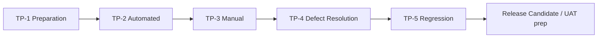

# Testing Phase Roadmap — TP-1 through TP-5

**Project:** Aarvii CCTV AMC Management System  
**Date:** 2026-06-12  
**Status:** TP-1 **Complete** · Recommend **Open TP-2**

---

## Phase overview

| Phase | Name | Goal | Code changes |
|-------|------|------|:------------:|
| **TP-1** | Testing preparation | Plans + readiness | ❌ None |
| **TP-2** | Automated testing | Run all automated suites; CI gates | Test infra only |
| **TP-3** | Manual testing | Smoke + exploratory; log defects | ❌ None |
| **TP-4** | Defect resolution | Fix P1–P3 defects | ✅ Freeze-compliant fixes |
| **TP-5** | Regression validation | Full re-test; sign-off | Fix regressions only |

---

## TP-1 — Testing preparation ✅ COMPLETE

**Duration:** Completed 2026-06-12  
**Objective:** Prepare test execution; assess readiness; **do not execute tests**

### Deliverables

| # | Deliverable | Path |
|---|-------------|------|
| 1 | Test execution plan | [test-execution-plan.md](./test-execution-plan.md) |
| 2 | Test environment plan | [test-environment-plan.md](./test-environment-plan.md) |
| 3 | Test data strategy | [test-data-strategy.md](./test-data-strategy.md) |
| 4 | Manual smoke checklist | [manual-smoke-checklist.md](./manual-smoke-checklist.md) |
| 5 | Test readiness review | [test-readiness-review.md](./test-readiness-review.md) |
| 6 | Defect management process | [defect-management-process.md](./defect-management-process.md) |
| 7 | Testing phase roadmap | This document |

### Exit criteria

- [x] All seven documents published under `docs/project/testing/`
- [x] Readiness assessed — **Conditional GO**
- [x] Recommendation to open TP-2 documented
- [x] No tests executed in TP-1

---

## TP-2 — Automated testing 🔜 RECOMMENDED NEXT

**Objective:** Execute automated test suites; satisfy freeze conditions C-03, C-04, C-05, C-06  
**Code changes:** Test infrastructure, CI tweaks, seed scripts only — **no product features**

### Entry criteria

- TP-1 sign-off (PM / QA / Dev / DevOps)
- Frozen branch or release tag identified

### Activities

| # | Activity | Owner | Maps to |
|---|----------|-------|---------|
| 1 | Run full `dotnet test Ashraak.slnx` — archive TRX | DevOps | C-03 |
| 2 | Fix **test infrastructure** failures only | Dev | C-03 |
| 3 | Staging DB restore + migration verify | DevOps | C-04 |
| 4 | Create smoke seed data on staging | DevOps + QA | Test data |
| 5 | `flutter analyze` + `flutter test` | Mobile lead | C-05 |
| 6 | Web: type-check, lint, vitest, build (Node 20+) | Frontend lead | C-06 |
| 7 | Confirm CI green on frozen branch | DevOps | C-03 |
| 8 | Document baseline test report | QA | Readiness |

### Exit criteria

| Gate | Pass |
|------|:----:|
| Backend: 0 failed tests | ☐ |
| Architecture: 21/21 pass | ☐ |
| TRX artifacts archived | ☐ |
| Staging restore + migrate verified | ☐ |
| Flutter analyze: 0 errors | ☐ |
| Flutter test: all pass | ☐ |
| Web type-check + lint + vitest + build green | ☐ |
| Baseline report published | ☐ |

### Out of scope

- Manual smoke (TP-3)
- Product defect fixes (TP-4)
- New E2E tests (optional; test-only if approved)

---

## TP-3 — Manual testing

**Objective:** Execute [manual-smoke-checklist.md](./manual-smoke-checklist.md); exploratory testing; **log all defects**  
**Code changes:** ❌ None (except P1 emergency waiver by PM)

### Entry criteria

- TP-2 exit criteria met
- Staging stable with seed data
- Defect tracker configured per [defect-management-process.md](./defect-management-process.md)

### Activities

| # | Activity | Owner |
|---|----------|-------|
| 1 | Full manual smoke checklist (all sections) | QA |
| 2 | Customer / Engineer / Admin / Mobile / Public | QA |
| 3 | Wave 4: reports, invoice admin, video, mobile auth | QA |
| 4 | RBAC negative tests | QA |
| 5 | Exploratory testing on high-risk areas | QA |
| 6 | Triage and prioritize all defects | QA lead + PM |
| 7 | Manual smoke sign-off report | QA lead |

### Exit criteria

| Gate | Pass |
|------|:----:|
| Smoke checklist executed | ☐ |
| All defects logged with severity/priority | ☐ |
| P1 defects counted and assigned for TP-4 | ☐ |
| Zero open S1 without PM waiver | ☐ |
| QA smoke report published | ☐ |

**Maps to freeze condition:** C-07 (manual smoke on staging)

---

## TP-4 — Defect resolution

**Objective:** Fix in-scope defects (P1–P3); verify individually  
**Code changes:** ✅ Allowed — freeze-compliant bug fixes only ([defect-management-process.md](./defect-management-process.md) §9)

### Entry criteria

- TP-3 complete with prioritized defect backlog
- Dev capacity allocated

### Activities

| # | Activity | Owner |
|---|----------|-------|
| 1 | Fix P1 defects first, then P2, then P3 | Dev |
| 2 | PR per defect or small batch; link issue ID | Dev |
| 3 | Add/update automated tests where practical | Dev |
| 4 | QA verify each fix | QA |
| 5 | Defer P4 to [deferred-items-register.md](../review/deferred-items-register.md) | PM |

### Exit criteria

| Gate | Pass |
|------|:----:|
| All P1 closed or waived | ☐ |
| All P2 closed or waived | ☐ |
| P3 disposition documented | ☐ |
| No open S1/S2 without waiver | ☐ |

---

## TP-5 — Regression validation

**Objective:** Confirm V1 quality for release candidate; no open critical path defects  
**Code changes:** Regression fixes only

### Entry criteria

- TP-4 exit criteria met
- Build tagged as release candidate

### Activities

| # | Activity | Owner |
|---|----------|-------|
| 1 | Full backend automated suite | DevOps |
| 2 | Web + mobile automated suites | Frontend / Mobile |
| 3 | Repeat full manual smoke checklist | QA |
| 4 | Close verified defects | QA lead |
| 5 | Testing completion report | QA lead + PM |
| 6 | Recommend UAT / production deploy | PM |

### Exit criteria

| Gate | Pass |
|------|:----:|
| All automated suites green | ☐ |
| Manual smoke repeat pass | ☐ |
| Open defects: only P4/deferred | ☐ |
| Testing completion report signed | ☐ |
| Freeze conditions C-03..C-07 evidence attached | ☐ |

---

## Timeline (indicative)

| Phase | Duration (estimate) | Dependencies |
|-------|---------------------|--------------|
| TP-1 | Complete | CF-1 freeze |
| TP-2 | 2–4 days | DevOps staging access |
| TP-3 | 3–5 days | TP-2 + seed data |
| TP-4 | 5–10 days | Defect count |
| TP-5 | 2–3 days | TP-4 |

*Adjust based on defect volume.*

---

## Roles

| Role | TP-2 | TP-3 | TP-4 | TP-5 |
|------|------|------|------|------|
| PM | Approve phases | Prioritize defects | Scope/waivers | Sign-off |
| QA lead | Baseline report | Smoke + triage | Verify fixes | Regression sign-off |
| Dev lead | Infra blockers | Support QA | Fix assignment | Escalation |
| DevOps | CI + staging C-04 | Env stability | Deploy fixes | RC deploy |
| Frontend | Web CI | Web smoke | UI fixes | Web regression |
| Mobile | Flutter CI | Device smoke | Mobile fixes | Mobile regression |

---

## Freeze condition traceability

| Condition | Phase |
|-----------|-------|
| C-03 Full backend CI tests | TP-2 |
| C-04 Staging DB restore | TP-2 |
| C-05 Flutter analyze/test | TP-2 |
| C-06 Web lint/type/test/build | TP-2 |
| C-07 Manual smoke staging | TP-3 |
| C-08 Defect process | TP-1 ✅ → active TP-3+ |

---

## Current recommendation

### ✅ Open TP-2 — Automated Testing

TP-1 is complete. Testing readiness is **Conditional GO**. Proceed with TP-2 activities per [test-execution-plan.md](./test-execution-plan.md).

**STOP** — Do not execute tests in TP-1. TP-2 begins only after stakeholder approval of [test-readiness-review.md](./test-readiness-review.md).

---

## References

- [test-readiness-review.md](./test-readiness-review.md)
- [test-execution-plan.md](./test-execution-plan.md)
- [code-freeze-decision.md](../review/code-freeze-decision.md)
- [testing-roadmap.md](../roadmap/testing-roadmap.md)
- [project-roadmap.md](../project-roadmap.md)

---

*TP-1 complete · Recommend TP-2*
