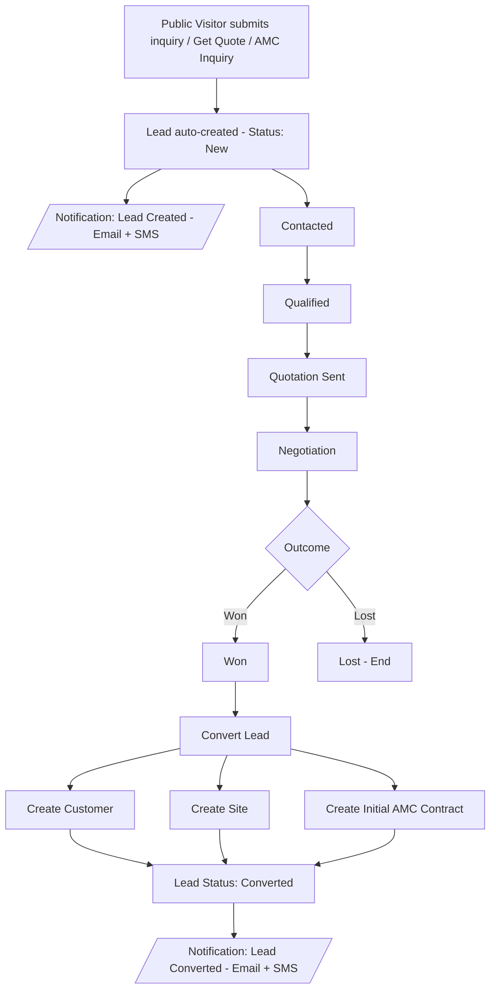
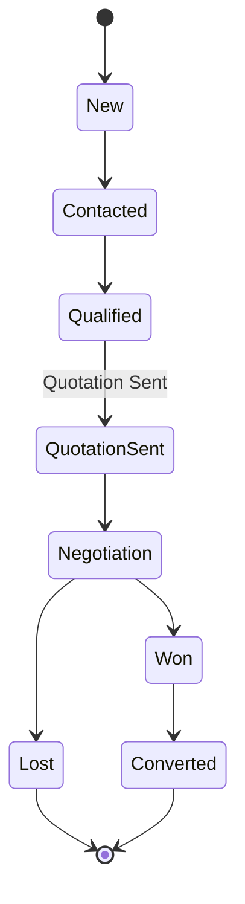
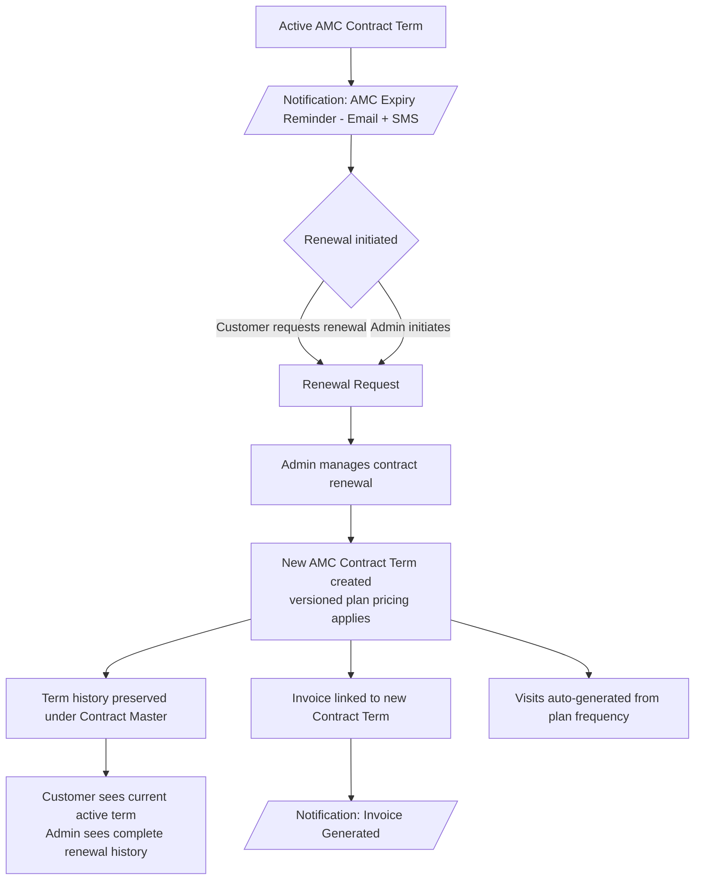
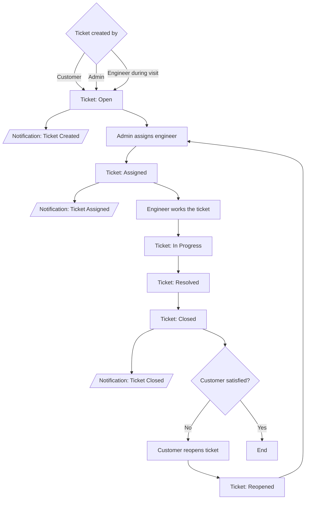
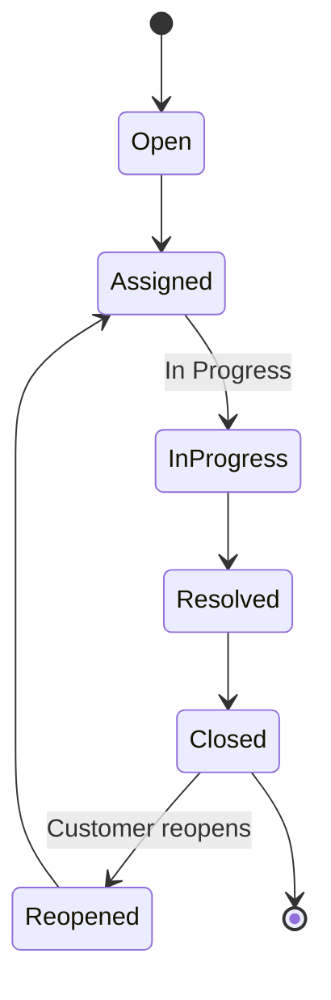
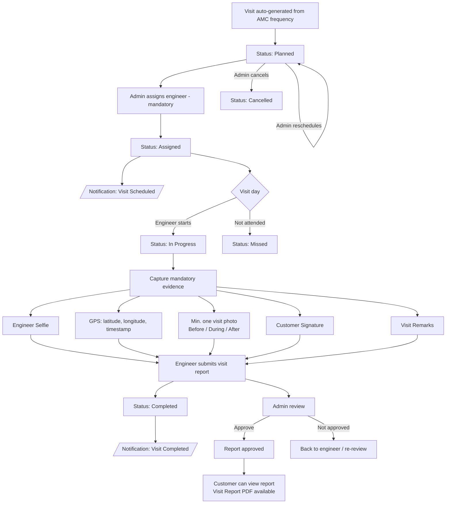
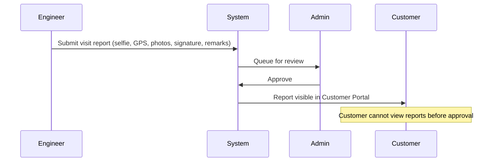
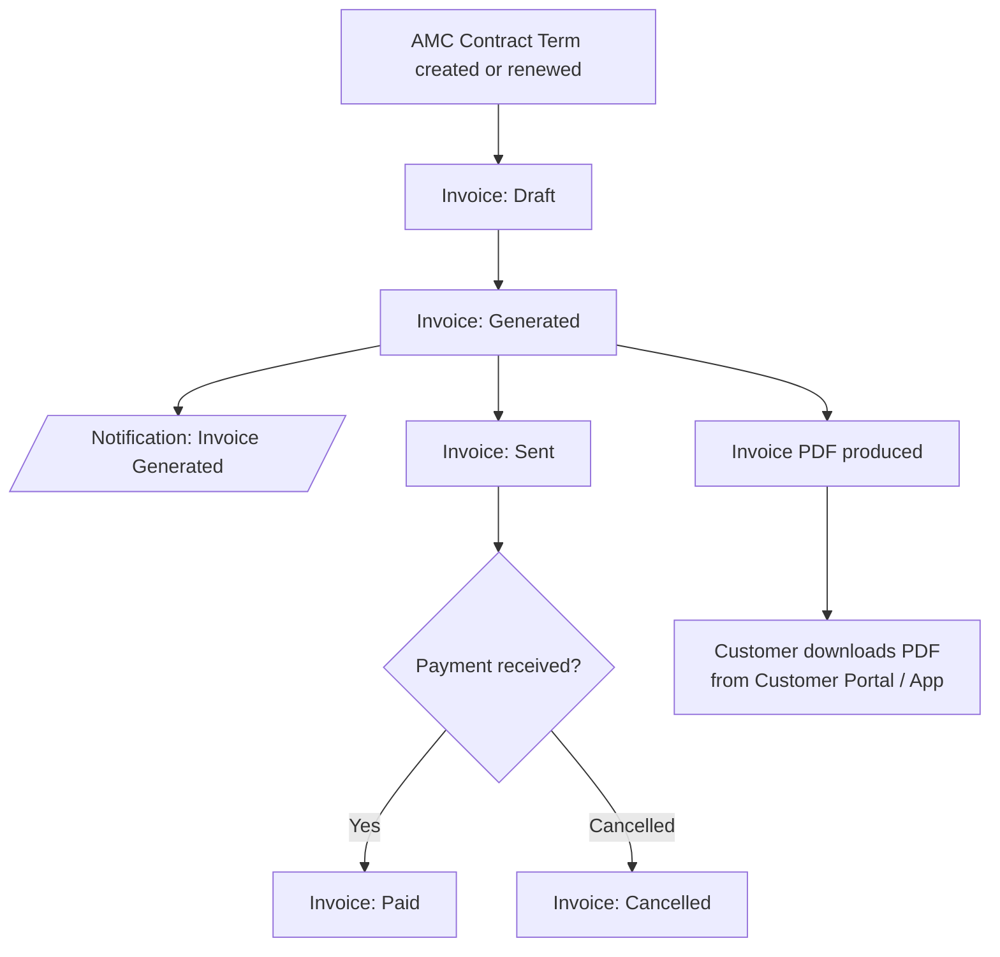
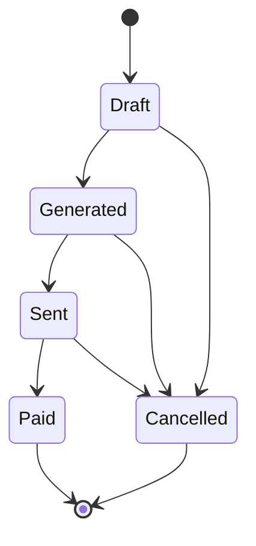
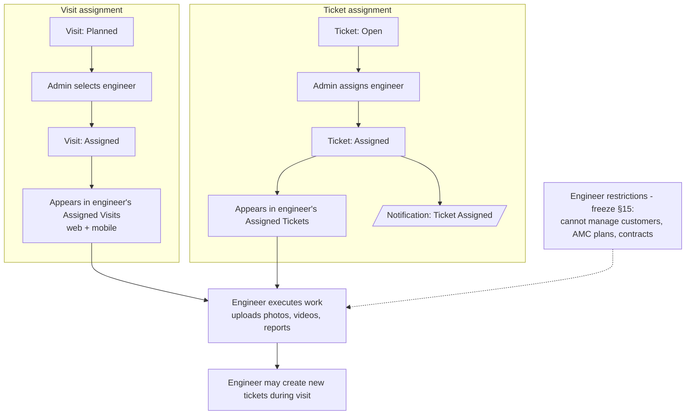

# Workflow Overview

**Project:** Aarvii CCTV AMC Management System
**Phase:** D0 — Project Foundation Documentation
**Source of truth:** [requirements-freeze-v1.md](./requirements-freeze-v1.md) (Approved & Frozen, V1)

Six core workflows derived from the frozen requirements. Statuses and transitions are exactly those approved in the freeze document.

---

## 1. Lead Conversion (§10)

Website inquiries automatically create leads; a converted lead creates Customer + Site + Initial AMC Contract.

### Lead status lifecycle

---

## 2. AMC Renewal (§8, §3, §17)

The AMC contract is permanent (master); each renewal adds a **Contract Term**. Customers see the current active term; admin sees full history.

---

## 3. Ticket Resolution (§14, §17)

### Ticket status lifecycle

Priorities (applied at creation, §14): Low · Medium · High · Critical.

---

## 4. Service Visit (§11, §12, §13)

Covers scheduling lifecycle, mandatory completion evidence, and the approval gate.

### Visit approval gate (§13)

---

## 5. Invoice Generation (§16, §17, §19)

### Invoice status lifecycle

Rules: invoice is linked to an AMC Contract Term; no accounting features in V1 (§16).

---

## 6. Engineer Assignment (§11, §14, §15)

Engineer assignment is mandatory for visits; tickets are assigned through the ticket lifecycle.

---

## Workflow ↔ rules traceability

| Workflow | Business rules | Freeze sections |
|----------|----------------|-----------------|
| Lead Conversion | BR-LEAD-01..03 | §10 |
| AMC Renewal | BR-AMC-01..08 | §3, §8, §9, §17 |
| Ticket Resolution | BR-TKT-01..06 | §14, §17 |
| Service Visit | BR-SCHED-01..04, BR-VISIT-01..07 | §11–§13 |
| Invoice Generation | BR-INV-01..05 | §16, §19 |
| Engineer Assignment | BR-SCHED-04, BR-VISIT-06..07 | §11, §14, §15 |

Rules detail: [business-rules.md](./business-rules.md)
